```{r setup}
#| echo: false

# the code below will load the necessary packages for these slides
# packages are normally loaded using library(packageName) after installing them.
# the `pacman` package has a function called `p_load` that checks if a package is 
# installed. If it isn't installed, it will install it, otherwise it will load it.

# this line installs the pacman package, if you need it
if(!require(pacman)){
  install.packages(pacman)
  library(pacman)
}

pacman::p_load(countdown)

```


## Teaching team

### Instructors:
- Dr. Rebecca Deek - [rdeek@pitt.edu](mailto:rdeek@pitt.edu) 
  - Office hours: **Tuesdays 2:30-3:30pm** (Until 10/2) & by appointment.
- Dr. Soumik Purkayastha - [soumik@pitt.edu](mailto:soumik@pitt.edu)
  - Office hours: **Thursdays 1:00-2:00pm** (From 10/5) & by appointment.

## Syllabus

## What you will (and won't) learn in PUBHLT0411
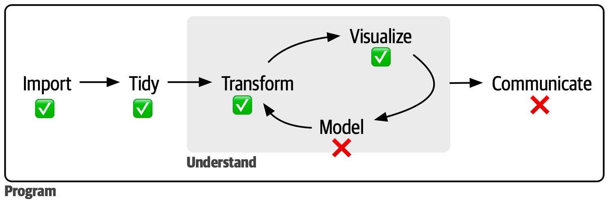{fig-alt="Steps of a data science project. Figure from R for Data Science ."}

- **Model:** PUBHLT 0412 and 0413
- **Communicate:** PUBHLT 0410, 0412, and 0413

## Coding + AI = ...?
- What is defined as AI?

:::{.fragment}
#### Language models

:::{.column width="50%"}
{fig-alt="Screenshot of MIT news article titled 'Can AI really code?'." height="400" fig-align=center}
:::

::: {.column width="50%"}
"We have tools that are way more powerful than any we’ve seen before. But there’s also a long way to go toward really getting the full promise of automation that we would expect."
:::

:::

## Vibe coding with AI
- There are many scenarios that AI can help with coding.
- It is important to have strong coding skills to understand where AI can produce errors/bugs, verbose code that can be made more efficient, or even hallucinates.

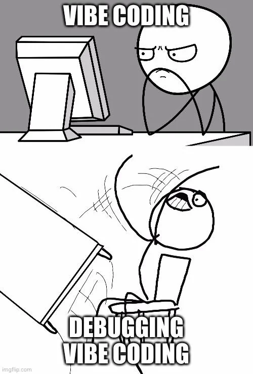{fig-alt="Decorative. Vibe coding meme" height="350" fig-align=center}

## R programming
- Common statistical programming language used by (bio)statisticians and data scientists.

:::: {.columns}

::: {.column width="50%"}
### Pros:
- Powerful, flexible, free.
- Open-source scripting language (unlike STATA/SAS).
- Active community.
- Help documentation and tutorials.
:::

::: {.column width="50%"}
### Cons:
- Syntax learning curve.
- No central support/core distribution.
- Potentially outdated packages.
- Not always fast.
- Not as well developed for deep learning/massive data.
:::

::::

## RStudio
::: {.r-stack}
::: {style="margin-top: 0px;"}
- RStudio is an Integrated Development Environment (IDE).
  - A software application that provides a comprehensive set of tools for programming and software development.
  - Simplifies programming for statistics and data science.
  - It *will* make your life easier.

:::

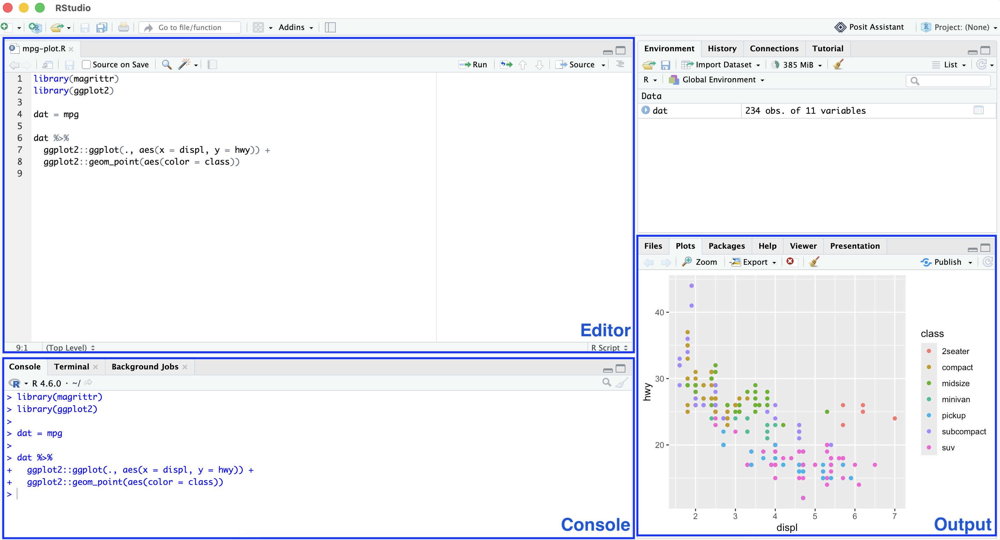{.fragment .fade-in fig-alt="Screenshot of RStudio IDE with editor, console, and output labeled." width=100%}
:::

## Organization
- Good programming starts with good organizational skills.

:::: {.columns}
:::{.column width="50%"}
{fig-alt="Decorative. XKCD meme with poorly named file scheme."}
:::

:::{.column width="50%"}
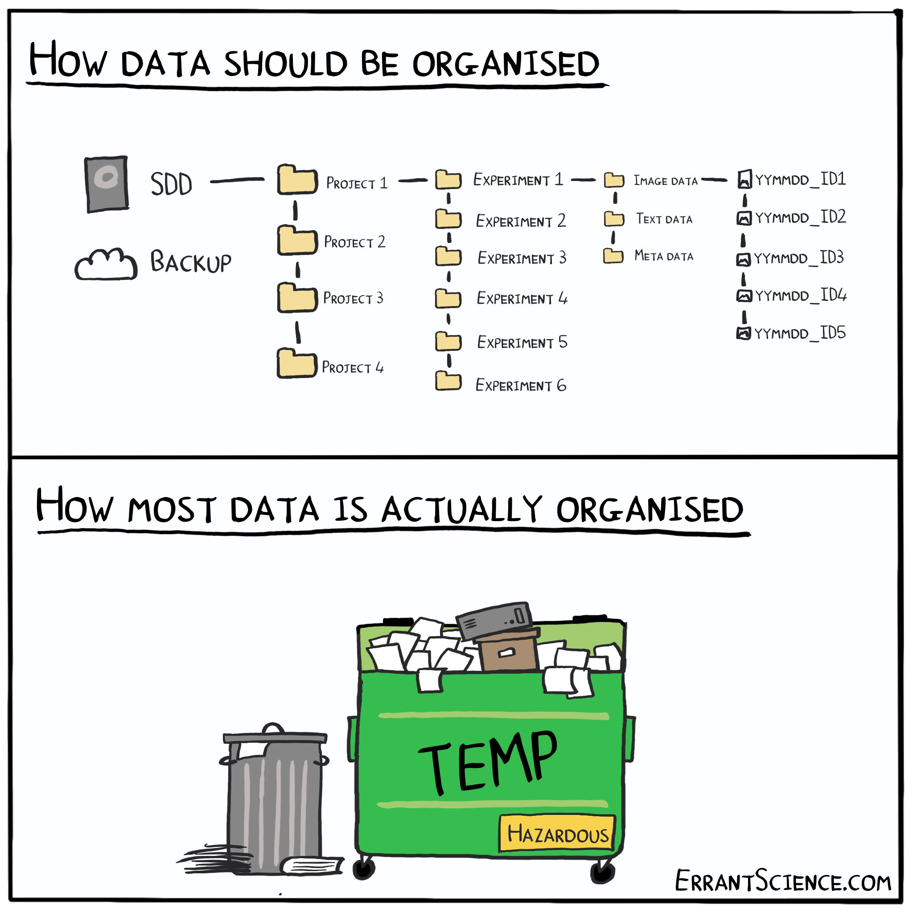{fig-alt="Decorative. Meme with poorly named folder structure."}
:::
::::

## Organizing your code: Part I {.smaller}
- Code is case sensitive.
- No autocorrect.
- Programming tools don't like spaces in object or file names, switch to underscores, dots, or camel case.
  - [this_is_snake_case]{style="font-family: monospace;"}
  - [THIS_IS_SCREAMING_SNAKE_CASE]{style="font-family: monospace;"}
  - [this-is-kebab-case]{style="font-family: monospace;"}
    - Cannot be used for naming objects in R.
  - [this.is.dot.case]{style="font-family: monospace;"}
  - [thisIsCamelCase]{style="font-family: monospace;"}
  - [tHis.isNOT_a.ConvenTIoN]{style="font-family: monospace;"}

## Organizing your code: Part II
- Similarly, programming tools don't like special characters. Avoid [!@$%^&*]{style="font-family: monospace;"} and the like.
- Object names should be informative.
  - [model1]{style="font-family: monospace;"}, [model2]{style="font-family: monospace;"}, [data.new]{style="font-family: monospace;"}, [data.old]{style="font-family: monospace;"} are *not* informative.
  - [model.unadj]{style="font-family: monospace;"}, [model.adj]{style="font-family: monospace;"}, [datasetName.rmAge]{style="font-family: monospace;"}, [boxplotAge]{style="font-family: monospace;"} are more informative.
- Complex naming conventions require strong regex skills.
  - If you don't know what regex is... fear not... but your naming conventions should be informative and simple.

## Organizing your files
- In the wise words of Jenny Byran, [file names should be](https://github.com/jennybc/how-to-name-files):
  1. Machine readable.
  2. Human readable.
  3. Sorted in a useful way.

:::{.column width="33%"}
{fig-alt="Screenshot of poor file naming system" fig-align=center}
:::

:::{.column width="33%"}
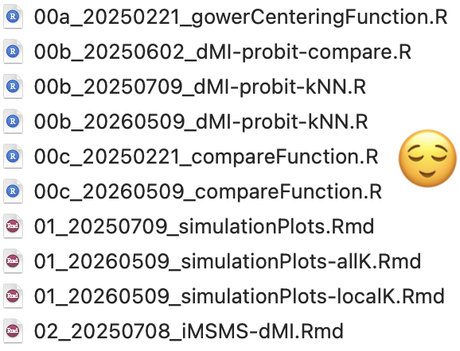{fig-alt="Screenshot of an informative file naming system" fig-align=center}
:::

:::{.column width="33%"}
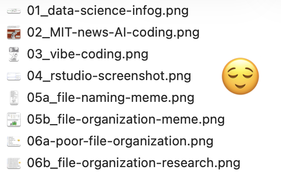{fig-alt="Screenshot of file names for this module!" fig-align=center}
:::

## Why you should care
- Extensive commenting will save you a lot of time, trouble, and frustration.
- Your worst enemy in programming is you six months ago.

{fig-alt="Decorative. Meme regarding poorly commented code." width="400" fig-align=center}

## R scripts
- Files that contain R code (and comments) are called R scripts.
- You can write code in the console but it's not suggested unless it's a quick and minor task (that you don't want to repeat again).
- Otherwise use an R script for more reproducible science:
  - Maintains a record of your analysis, including data manipulation, visualization, and statistical analysis.
  - Can share code (and data) with others, including collaborators and journals.
- .rmd (R) and .qmd (Quarto) markdown files intertwine R code and plain text language (more in a few slides).

## R Projects {.smaller}
- We will start this course by using data that is already loaded into R.
  - Eventually you will in access data files on your computer.
  - Sooner than that you will need to access the files I create for you (lectures, labs, etc.)
- A "working directory" is where R looks for files that you ask it to load.
  - My default working directory is `"/Users/rdeek"`.
- Keeping all the files associated with a given project (data, R scripts, results, figures, etc.) in one directory is a wise and common practice.
  - RStudio has R projects that help with this.
    - Avoids manually setting the working directory with `setwd()`
    - Facilitates the use of relative paths like `data/dataFileName.csv`.
      - If I share code and data with you as long as we both have a project and data folder, the code will run without errors.

. . .

```{r getwd}
getwd()
```

- [Guide to using RStudio Projects](https://support.posit.co/hc/en-us/articles/200526207-Using-RStudio-Projects)

## Directory setup for PUBHLT0411
- **Non-negotiable**: 
  - A folder named "PUBHLT0411".
    - An .Rproj with the same name saved in it.
  - A "data" subfolder.

- **Suggested (if you want to reduce frustration)**:
  - "lecture" subfolder.
  - "lab" subfolder.
  - "final-project" subfolder.

## Qmd/Rmd {.smaller}
- A Quarto Markdown file (.qmd) is a plain-text document that combines plain text, executable code chunks, and formatting metadata.
  - All lectures and labs will be completed in .qmd files.
  - Similar to Rmarkdown (.rmd) but next generation.

. . .

- Three main components:
  - Metadata: YAML formatting.
  ```yaml
  title: "Module 0: Hello World! Syllabus and basics"
  subtitle: "PUBHLT0411: Statistical Packages for Public Health Data Analysis"
  author: Rebecca Deek, PhD
  institute: University of Pittsburgh, Biostatistics and Health Data Science
  format: revealjs
  ```
  - Plain text: Markdown.
      - Markdown is a plain text format that is designed to be easy to write and read. Learn more about [Markdown basics](https://quarto.org/docs/authoring/markdown-basics.html).
  - Code: Executed via `knitr` or `jupyter`.
```r
library(tidyverse)
x = 10
y = 20
x + y
```

## R packages
- R stores numerous packages that contain functions and datasets that others can use.
  - Packages are the fundamental unit of shareable code.
- Some packages come preinstalled and loaded (e.g., `base`).
- Others needs to be installed and loaded (in that order).
```r
install.packages("packman")
library(packman)
```
- `packman` is a package, which needs to be installed and loaded, that bundles installation and loading of other packages.
```r
packman::p_load(tidyverse)
```

# Time to code!!!


## R can be used as a calculator

```{r addition}

2+2 # addition

```

. . .

```{r order-of-op1}

# natural order of operations
1+2*3
1 + (2*3)

```

. . .

```{r order-of-op2}

(1+2)*3

```

## R can be used as a calculator

```{r r-calculations1}

log(2) # logarithm, base e
log10(2) # logarithm, base 10
exp(2) # exponential

```

. . .

```{r r-calculations2}

sqrt(4)
4^2

```

. . .

```{r r-calculations3}

pi
sin(1)

```

## Objects in R
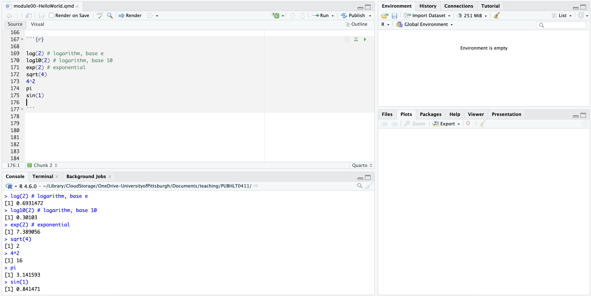{fig-alt="Screenshot of code from prior slide showing that no objects were saved to the environment. Code was written in a Markdown file and ran in the console." fig-align=center}

## Assigning values to objects in R

```{r assigning-objects}

my_object_equal = 30
my_object_equal

my_object_arrow <- 30
my_object_arrow

```

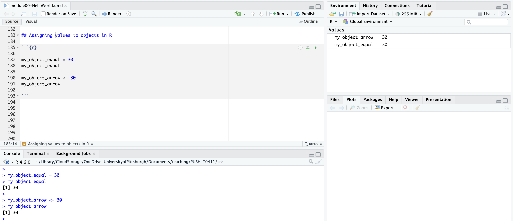{fig-alt="Screenshot of above code showing that two objects are now saved to the environment. Code was written in a Markdown file and ran in the console." width=90% fig-align=center}

## Different types of objects

```{r character-objects}

character.object = "I love PUBHLT 0411!!"

```

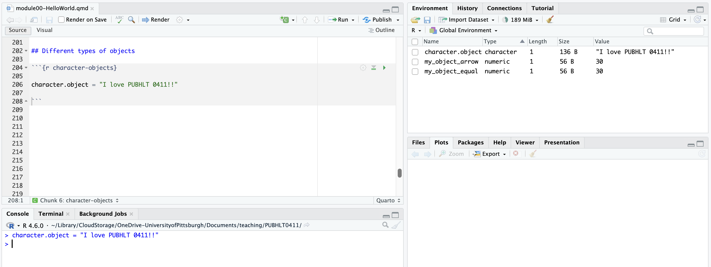{fig-alt="Screenshot of above code showing that a new charcater object is now saved to the environment. Code was written in a Markdown file and ran in the console. The environment view has switch from list to grid" fig-align=center}

. . .

```{r printing-objects}

character.object
print(character.object)

```

## Aside: Start with a blank workspace {.smaller}
- Every time you close RStudio it will prompt you to decide if you want to save your environment. You should **always** select no.
  - Helps with reproducibility and preventing old mistakes from spilling over.
- Alternatively, you can turn this off in your settings (Tools > Global Options)

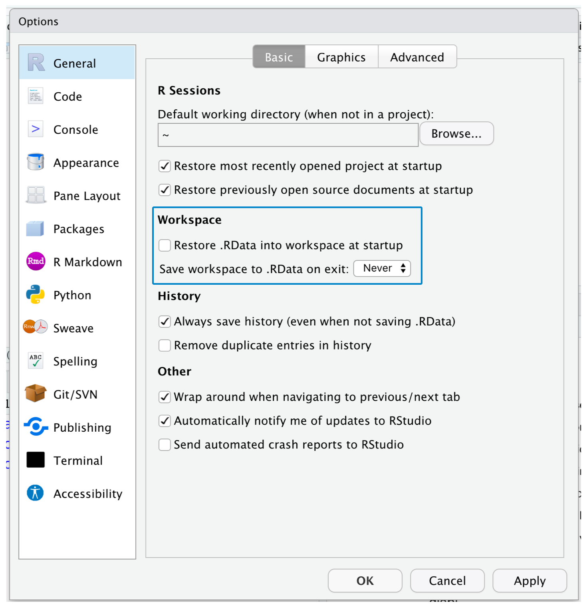{fig-alt="RStudio Global Options with a blue box around Workspace showing to save workspace never." height=4.5in fig-align=center}

## Operations with objects {.smaller}
- Writing over objects.
```{r operations1}

my_object_arrow

my_object_arrow <- "thirty"
my_object_arrow

```

. . .

- Basic arithmetic with objects.

```{r operations2}

x = 320
y = 90
x + y

```

. . .

```{r character-errors}
#| error: TRUE

ch.obj1 = "Hello"
ch.obj2 = "World!"
ch.obj1 * ch.obj2

```

## More operations with objects

- Concatenate scalars into vectors of length $<1$.

```{r vector}

twos = c(2, 4, 6, 8)
twos

```

. . .

```{r concatenate-func}

c(ch.obj1, ch.obj2)

```

. . .

- `c()` is what we call a function. 

## Functions
- R has built in functions, which take the form:

```r
function_name(argument1 = value1, argument2 = value2, ...)
```

::::{.columns}

:::{.column width ="50%"}

- For example,  

```{r ex-functions}

mean(x = twos)
mean(twos) # lazy eval
mean(x = twos, na.rm = T)

```
:::

:::{.column width="50%"}
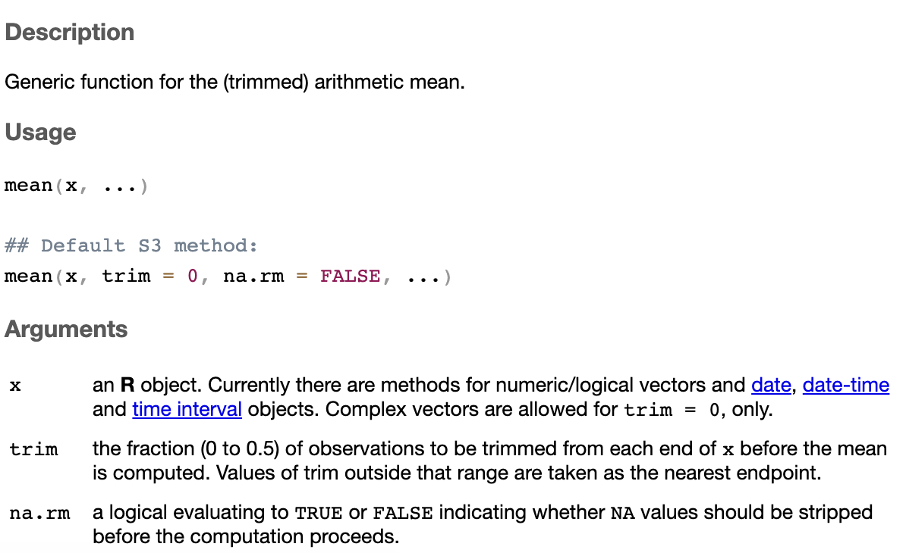{fig-alt="R help documentation for the 'mean()' function."}
:::

::::

## Missing data and functions
::: notes
- Many functions in R default to keeping missing data. Many have an argument `na.rm` to remove them.
:::

```{r na-values1}

mean(x = twos, na.rm = TRUE)  # remove NAs
mean(x = twos, na.rm = FALSE) # keep NAs

```

. . .

```{r na-values2}

twos = c(twos, NA)
twos

mean(x = twos, na.rm = TRUE)
mean(x = twos, na.rm = FALSE)

```

. . .

- This is common for R functions that perform arithmetic.

```{r na-values3}

var(x = twos)
var(x = twos, na.rm = T)

```

## Additional functions
- `seq()` and `rep()`

```{r seq}

my.sequence = seq(from = 1, to = 10, by = 1)
my.sequence
my.seq.shortcut = 1:10
my.seq.shortcut

```

. . .

```{r rep}

my.rep = rep(x = 2, times = 10)
my.rep

my.rep2 = rep(x = 1:3, times = 2)
my.rep2

myrep3 = rep(x = c("a", "b", "c"), each = 2)
myrep3

```

## Exercises
How should the code below be corrected?

##### 1)

```{r exercise1}
#| error: TRUE

firstObj = 10
second.obj = 2
third_object = firstobj + second.obj

```

##### 2)

```{r exercise2}
#| error: TRUE

third_object

```

##### 3)

```{r exercise3}
#| error: TRUE

character.object.error = I love PUBHLT 0411!!

```

`r countdown(minutes = 4)`

## Lab 0

## That's all... until Thursday.
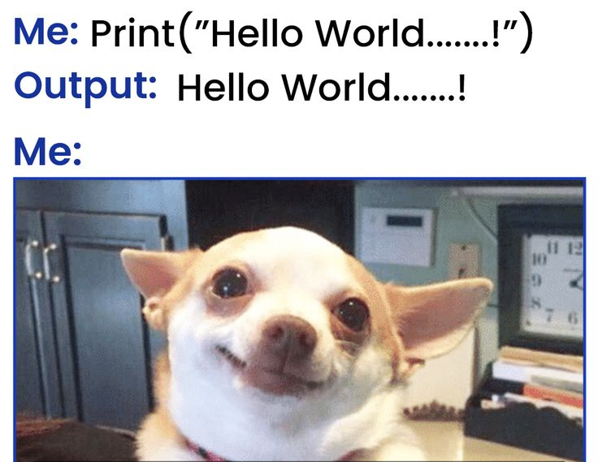{fig-alt="Decorative." fig-align=center}
