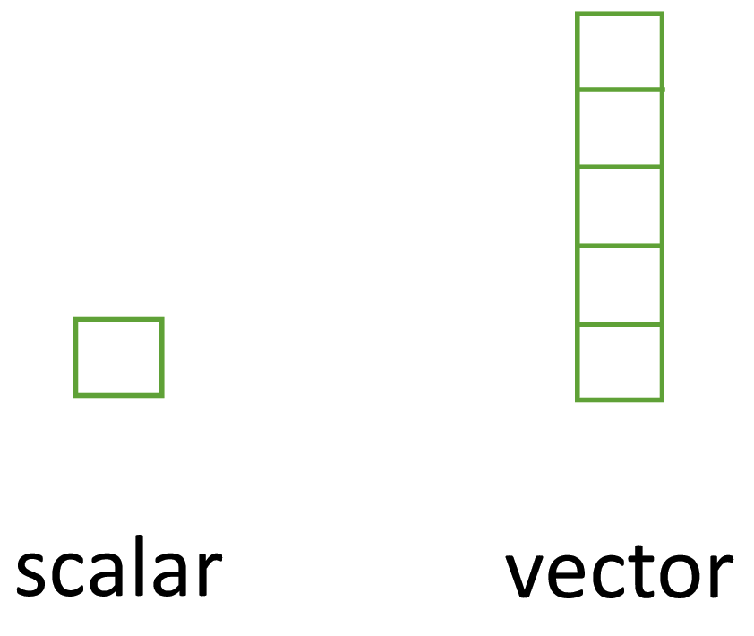
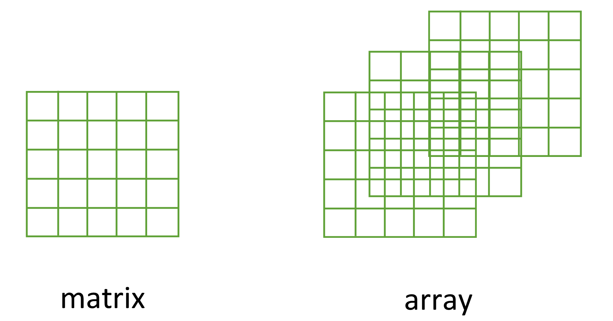
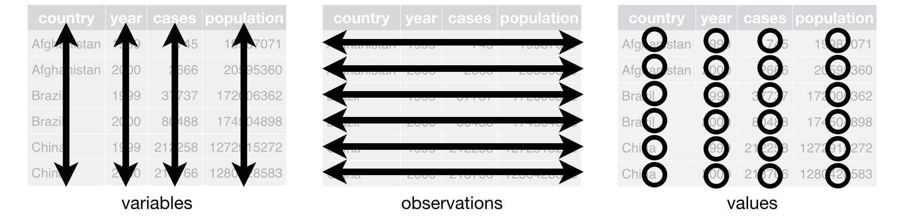

```{r setup}
#| echo: FALSE

# the code below will load the necessary packages for this assignment
# packages are normally loaded using library(packageName) after installing them.
# the `pacman` package has a function called `p_load` that checks if a package is installed.
# if it isn't installed, it will install it, otherwise it will load it.

# this line installs the pacman package, if you need it
if(!require(pacman)){
  install.packages(pacman)
  library(pacman)
}

pacman::p_load(countdown)
pacman::p_load(knitr)
pacman::p_load(kableExtra)

```

## Data types {.smaller}

R has six basic types of data: **double/numeric, integer, logical, character, complex and raw**. We will focus on:

1. **Double [Numeric]**: data that are numbers with decimals.
   - Double refers to how R stores the object in memory.
2. **Integers**: data that are numbers without decimals.
3. **Logical**: data that take the value of either `TRUE` or `FALSE`.
   - Special type for `NA` to represent missing data.
4. **Character**: data that are used to represent strings (e.g., word[s]).
   - Special type: factors, which have ordering (levels).

## Checking data types with `typeof()` {.smaller}

- Often, R can distinguish data types using context.

```{r typeof-func}

numb = c(3, 5) # type: numeric
typeof(numb)

char = "PUBHLT0411" # type: character
typeof(char)
char2 = "F" # type: character
typeof(char2)

logi1 = TRUE # type: logical
typeof(logi1)
logi2 = F # type: logical
typeof(logi2)

```

- Sometimes you'll need to explicitly tell R how to treat an object.

## Checking types with a logical test

- Alternatively, there is a family of functions that perform a logical test to determine data types.
  - Outputs are logicals: `TRUE` or `FALSE`.

```{r logical-test-types}

is.numeric(numb)
is.character(numb)
is.character(char)
is.logical(logi2)

```

## Special case: Checking for `NA`

```{r check-na}

scalar.na = NA # single value (scalar)
typeof(scalar.na)
numb.na = c(3, 5, NA) # vector
is.na(numb.na)

```

- We say that `is.na()` is a *vectorized* function, meaning it checks each element of the vector (automatically) and returns a logical for each index.

. . .

```{r check-numb-vect}

is.numeric(numb.na)

```

- `is.numeric()`, and the like (character, logical, etc.), are not vectorized. They look at the overall type of the object.

## Coercion with `c()`
::: notes
- Mixed type with numbers converts T/FALSE to 1/0, respectively
- Mixed type with characters converts 1/T to "1"/"TRUE", respectively
:::

- What happens if we create a vector with mixed types?

```{r c-coercion}

mixed.type.vector1 = c(T, 5, 9, FALSE)
mixed.type.vector1 # T/FALSE become numeric
typeof(mixed.type.vector1)

mixed.type.vector2 = c(1, "abc", "dog", T)
mixed.type.vector2 # 1/T become strings
typeof(mixed.type.vector2)

```

. . .

- R unifies the vector to the most general type. From least to most general:
$$ \textrm{logical} \rightarrow \textrm{integer} \rightarrow \textrm{double} \rightarrow \textrm{character}$$

## Coercing the type of objects {.smaller}
::: notes
- Important for blood types to viewed as a character for statistics. We should be able to calculate the mean, sd, etc. for blood times. Also important for regression models.
:::

- There may be times where it will be useful to change the type of a variable using a coercion function.
  - E.g., a study collected blood groups and coded them as: **O = 1; A = 2; B = 3; AB = 4**.

```{r type-coercion1}

blood.types.numb = c(1, 2, 1, 4, 3, 3) # O, A, O, AB, B, B
typeof(blood.types.numb)

```

- R is treating our vector as a numeric but the coding really represents discrete blood types. **Character** data type is more appropriate (or **factor**, up next).

. . .

```{r type-coercion2}

blood.types.char = as.character(blood.types.numb)
blood.types.char
typeof(blood.types.char)

```

. . .

- We can coerce back to numeric (but doesn't always work as expected).

```{r type-coercion3}

blood.types.numb2 = as.numeric(blood.types.char)
blood.types.numb2
typeof(blood.types.numb2)

```

## Coercing the type of objects {.smaller}

- Coercion does not always work in the way we expect.

```{r type-coercion4}

eye.color = c("blue", "brown", "green", "gray", "hazel")
eye.color
typeof(eye.color)

# convert to numeric
eye.color.numb = as.numeric(eye.color)
typeof(eye.color.numb)
eye.color.numb

```

. . .

- This is the more standard outcome in R.
  - The prior example worked because our strings were just numbers (no text).
- Generally, R doesn't know how to convert strings (in this case colors) into numeric values.
  - There is no clear ordering to the colors.

## Factors {.smaller}
::: notes
- If levels are not provided they are taken from the unique observations and ordered in appearance order.
:::

- Factors are used for variables that have a fixed and known set of possible values.
  - Also useful if character vectors have a specific order.

```{r factors1}

day = c("Th", "W", "M", "F", "F",  "T",  "F",  "W" )
sort(day)

```

- Sorting a character vector returns elements in alphabetical order.

. . .

- Factors require levels, which can be specified or assumed from the data.
  - Labels are optional and do not have to match levels.

```{r factors2}

day.levels  = c("M", "T", "W", "Th", "F") # string of levels - in order
# x = vector of data; levels = optional vector of the unique values
day.factor = factor(x = day, levels = day.levels)
day.factor
levels(day.factor)
```

. . .

```{r factors3}

sort(day.factor)

```

## Factors: `typeof` versus `class` {.smaller}

- R stores factors as integers for efficiency. The integer values correspond to the locations of each element in the levels.

```{r factors4}

typeof(day.factor)
day.factor
as.numeric(day.factor)

```

. . .

- `typeof()` tells how an object is stored in R's internal memory storage. `class()` tells how an object is stored for programming.
  - Similar to how `typeof()` differentiates between `double` and `integer` but `class()` returns `numeric` for both.

```{r factors5}

class(day.factor)

```

## Factors: Missing and changing levels

- Missing levels are coded as `NA`
```{r factors6}

day.factor2 = factor(x = c(day, "Sa"), levels = day.levels)
day.factor2

```

. . .

- The first element of the levels is called the reference. This can be changed.

```{r factors7}

table(day.factor) # count # of obs per day

day.factor.F = relevel(x = day.factor, ref = "F")
day.factor.F

```


## Data types: Summary

```{r summary-table}
#| echo: FALSE

type.summary.table = data.frame(
  Type = c("Character", "Numeric", "Logical", "Factor", "Complex"),
  `Logical test` = c("is.character", "is.numeric", "is.logical", "is.factor", "is.complex"),
  Coercing = c("as.character", "as.numeric", "as.logical", "as.factor", "as.complex"),
  check.names = FALSE
)

knitr::kable(x = type.summary.table, align = "ccc") |> 
  kableExtra::kable_styling(full_width = FALSE) |> 
  kableExtra::row_spec(row = 0, bold = TRUE) |> # bold title column
  kableExtra::row_spec(row = c(1,3,5), background = "#e0e0e0") |> # makes alternating lines white and grey
  kableExtra::column_spec(column = 2:3, monospace = TRUE) # monospace font for the code columns

```

## Lab 1

## Data structures: Vectors

- Atomic vectors are the basic data structure in R.
- Homogeneous (all one data type) and 1D.
- Important properties: `typeof()`, `length()`, and `attributes()`
- Vectors of length 1 are scalars.

{fig-alt="Diagram comparing a scalar, shown as a single small square, to a vector, shown as a column of five stacked squares." width=35% fig-align=center}

## Functions for vectors

```{r atomic-vectors1}

scalar = c(10) # scalar
length(scalar)

vec = c(23, 49, 6, 56, 92) # 5-dimensional vector
length(vec)

```

. . .

- Vectors can be named. Names are considered an attribute.

```{r atomic-vectors2}

named.vec = c("e1" = 23, "e2" = 49, "e3" = 6, "e4" = 56, "e5" = 92)
named.vec
length(named.vec)
names(named.vec)

```

## Data structures: Matrices and arrays
- Matrices are vectors with an additional dimension (2D).
- Arrays are multidimensional matrices (N-dimensional).
- Matrices and arrays must be homogeneous, containing elements all of the same data type.

{fig-alt="Diagram comparing a matrix, shown as a single 5x5 grid, to an array, shown as multiple stacked 5x5 grids offset diagonally to represent higher dimensions." width=65% fig-align=center}

## Matrices and arrays {.smaller}

- Matrices are more common for (bio)statistics.

```{r matrix}

mat1 = matrix(data = 1:12, nrow = 4, ncol = 3, byrow = TRUE)
mat1

```

. . .

- Arrays are less common but can still be useful.

```{r array}

array1 = array(data = 1:12, dim = c(2, 3, 2)) # dim: rows, columns, matrices.
array1

```

- Order of the `dim` argument: rows, columns, matrices.

## Functions for matrices and arrays {.smaller}

- Generalizations of `length()`: `dim()`, `nrow()`, `ncol()`.

```{r mat-array-funcs1}

dim(mat1) # rows, columns
nrow(mat1)
ncol(mat1)

```

. . .

- Generalizations of `names()`: `rownames()` and `colnames()`.

```{r mat-array-funcs2}

# call names
rownames(mat1)
colnames(mat1)

```

. . .

- Can provide/assign names using the same functions:

```{r mat-array-funcs3}

# provide names
rownames(mat1) = c("r1", "r2", "r3", "r4")
colnames(mat1) = c("c1", "c2", "c3")
rownames(mat1)

```

## Matrix math

```{r matrix-math1}

sq.mat1 = matrix(data = 1:4, nrow = 2, byrow = TRUE)
sq.mat2 = matrix(data = 5:8, nrow = 2, byrow = TRUE)
sq.mat1

```

. . .

```{r matrix-math2}

t(sq.mat1) # transpose
diag(sq.mat1) # diagonal

```

. . .

```{r matrix-math3}

sq.mat1 + sq.mat2 # addition

sq.mat1 %*% sq.mat2 # multiplication

```

## Comparison of vectors, matrices, arrays

```{r}
#| echo: FALSE
#| messsage: FALSE

structure.summary.table = data.frame(
  Vector = c("names()", "length()", "c()", "—", "is.null(dim(x))"),
  Matrix = c("rownames(), colnames()", "dim(), nrow(), ncol()", "rbind(), cbind()", "t()", "is.matrix()"),
  Array  = c("dimnames()", "dim()", "abind::abind()", "aperm()", "is.array()")
)

structure.summary.table |> 
  knitr::kable(col.names = c("Vector", "Matrix", "Array")) |> 
  kableExtra::kable_styling(full_width = FALSE) |> 
  kableExtra::row_spec(row = 0, bold = TRUE) |> # bold title column
  kableExtra::row_spec(row = c(1,3,5), background = "#e0e0e0") |> # makes alternating lines white and grey
  kableExtra::column_spec(column = 1:3, monospace = TRUE) # monospace font for the code columns

```

## Data structures: Lists

- Lists are heterogeneous, meaning they can store mixtures of data types and structures.
- Ideal for storing irregular or non-rectangular data.

```{r lists1}

list1 = list(character = c("John Smith", "Jane Doe"), 
             double = c(62, 45), 
             matrix = matrix(data = 1:4, nrow = 2, byrow = T)
             )
list1
names(list1)

```

## Renaming lists

- Elements of lists can be renamed used `names()`.

```{r lists2}

# rename list elements
names(list1) = c("name", "age", "variables")
list1

```

## Data structures: Data frames
- Most common structure to store data.
- Similar to matrices (2D) but can be heterogeneous.
  - Different data types per column.
  - Stored in R as a **list** of equal length vectors.
- Rectangular tidy data: all columns must have the same number of observations. Missing data are code as `NA`.

{fig-alt="Diagram illustrating tidy data concepts using a table with columns country, year, cases, and population. Three panels show the same table with different elements highlighted: 'variables' (vertical arrows spanning each column), 'observations' (horizontal arrows spanning each row), and 'values' (circles around each individual cell)." fig-align=center}

## Functions for data frames {.smaller}

```{r df1}

df = data.frame("name" = c("John", "Jane", "William", "Elizabeth"), # variable name = elements syntax
                "age" = c(62, 45, 39, 27), 
                "city" = c("PGH", "SEA", "NYC", "CHI"), 
                stringsAsFactors = F # keep strings characters
             )
df
```

. . .

```{r df2}
head(df, n = 2)

```

. . .

```{r df3}

dim(df) # rows, columns
nrow(df)
ncol(df)

str(df)

```

## Coercion and testing data frames {.smaller}

`as.data.frame()` coerces an object to a data frame.

- A vector creates a one-column data frame.

```{r df-coerce1}

twos = c(2, 4, 6, 8)
vect.to.df = as.data.frame(twos)
vect.to.df
is.data.frame(vect.to.df)

```

. . .

- A list creates one column for each element. An error is produced if they’re not all the same length.

```{r df-coerce2}

list.to.df = as.data.frame(list1)
list.to.df
is.data.frame(list.to.df)

```

## Coercion and testing data frames {.smaller}
- A matrix creates a data frame with the same dimensions.

```{r df-coerce3}

mat.to.df = as.data.frame(mat1)
mat.to.df # preserved row/column names
is.data.frame(mat.to.df)

```

. . .

- Binding the rows (vertical stacking) can be helpful for combining two matrices.
  - Must be of the same dimension and have the same column names.

```{r rbind}

sq.mat1.df = as.data.frame(sq.mat1)
sq.mat2.df = as.data.frame(sq.mat2)
sq.mat1.df # col name automatically assigned matrix -> df

rbind(sq.mat1.df, sq.mat2.df)

```

## Types of subsetting
- Complex operations can be performed succinctly with subsetting objects.
- Three subsetting operators: `[[]]`, `[]`, and `$`.
  - Interact differently with each data structure. 
- `[[]]` and `$` select single elements.
  - `$` is a shortcut for `[[`.
- `[]` selects any number of elements.

## Positional subsetting: Vectors {.smaller}
- `[+]`: Keeps elements at specified positions, keeps attributes.
- `[-]`: Drops elements at specified positions, keeps attributes.
- `[[+]]` selects a single element, drops attributes.
- `$` doesn't work for vectors.

::::{.columns}

:::{.column width ="50%" .fragment}
```{r subset-vec1}
#| error: TRUE

named.vec[]
named.vec[1]
named.vec[-2]
named.vec[c(1,3)] # multiple elements in c()
named.vec[-c(2,4)]

```
:::

:::{.column width ="50%" .fragment}
```{r subset-vec2}
#| error: TRUE

named.vec["e1"]
named.vec[["e1"]]
named.vec[[c("e1", "e2")]]
named.vec$e1


```
:::

::::

## Positional subsetting: Lists {.smaller}
- `[+/-]` always returns a list with attributes.
- `[[+]]` and `$` returns the object (type) in the called element.

::::{.columns}

:::{.column width ="50%"}

:::{.fragment}
```{r subsetting-lists1}

list1[1]
list1[[1]]
list1$name

```
:::

:::{.fragment}
```{r subsetting-lists2}

typeof(list1[1])
typeof(list1[[1]])
typeof(list1$name)

```
:::

:::

:::{.column width ="50%" .fragment}
```{r subsetting-lists3}

list1[-2]
list1[c(1,2)]
list1[-c(2,3)]
list1[[c(1,2)]] # no error but not as expected!

```
:::

::::

## Positional subsetting: Data frames {.smaller}
- `[,+/-]` select or drops one or more **columns**.
- `[+/-,]` select or drops one or more **rows**.
- `[[]]` and `$` select a single column.

::::{.columns}

:::{.column width ="50%" .fragment}
```{r subsetting-df1}

df[,1]
typeof(df[,1]) # vector
df[,1:2]
typeof(df[,1:2]) # list, class = df
df[1,]
typeof(df[1,]) # list, class = df

```
:::

:::{.column width ="50%" .fragment}
```{r subsetting-df2}
#| error: TRUE

df[1:2,c(2,3)]

df[[2]]
df[["age"]]
df$age
df[[c("age", "city")]]
df[,c("age", "city")]

```
:::

::::

## Logical subsetting {.smaller}
- Can only be performed with `[]`.
  - Available logical operators: `>` (greater than), `>=` (greater than or equal to), `<` (less than), `<=` (less than or equal to), `==` (equal to), and `!=` (not equal to).
  - Conditions with `&` indicate "and" statements (check for both conditions). Conditions with `|` indicate "or" statements (check for either condition).

. . .

::::{.columns}

:::{.column width="50%"}
```{r logical-subsetting1}

vec
vec < 50
vec[vec < 50]

```

```{r logical-subsetting2}

df$name == "John"
df[df$name == "John",]
df[df$name != "John",]


```
:::

:::{.column width="50%" .fragment}
```{r logical-subsetting3}

df[df$city %in% c("PGH", "NYC"),]
df[df$age > 40,]
df[df$age > 40 & df$city == "PGH", ] # and
df[df$age > 40 | df$city == "PGH", ] # or
list1[names(list1) == "name"]

```
:::

::::

## Advanced positional subsetting {.smaller}
::: notes
- list1["age"] returns a list cannot perform math operations
:::
- We can override/change variables with subsetting.
- Subsets that return the object (type) for lists can be operated on.

::::{.columns}

:::{.column width="50%"}

:::{.fragment}
```{r adv-subset1}
df$city = as.factor(df$city)
df$city
```
:::

:::{.fragment}
```{r adv-subset2}
city2 = c("BOS", "LA", "SF", "DC")
df$city = city2
df$city
```
:::

:::

:::{.column width="50%"}

:::{.fragment}
```{r adv-subset3}
df$age * 12
df[[2]] * 12
df[,2] * 12
```
:::

:::{.fragment}
```{r adv-subset4}
#| error: TRUE

list1$age * 12
list1[["age"]] * 12
list1["age"] * 12
```
:::

:::

::::

## Lab 1
