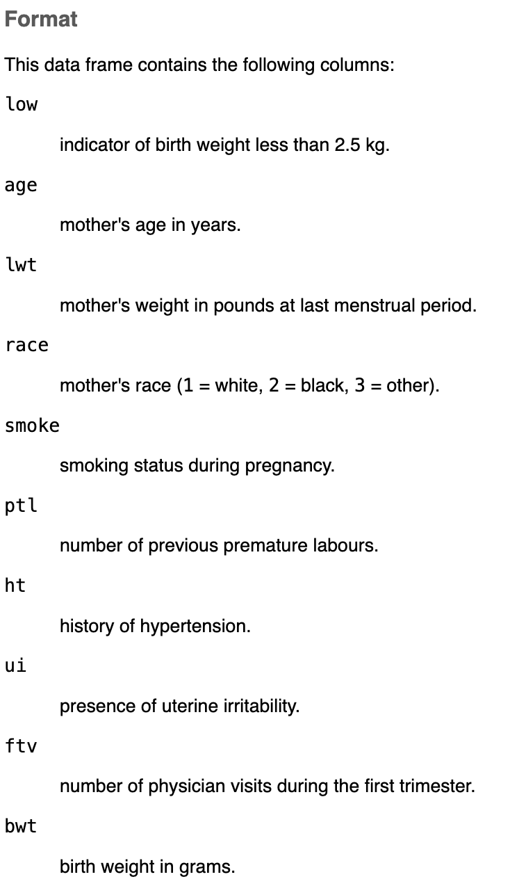

## Housekeeping/setup {.smaller}

```{r setup}

# the code below will load the necessary packages for these slides
# packages are normally loaded using library(packageName) after installing them.
# the `pacman` package has a function called `p_load` that checks if a package is 
# installed. If it isn't installed, it will install it, otherwise it will load it.

# this line installs the pacman package, if you need it
if(!require(pacman)){
  install.packages(pacman)
  library(pacman)
}

pacman::p_load(countdown)
pacman::p_load(MASS)
pacman::p_load(tidyverse)

# data setup
data(birthwt)

```

## Graphics in R

- Summarizing data, numerically or graphically, is a critical part of data analysis.
- There are three main ways to visualize data in R: 
  - Base R: Original built-in plotting system.
  - `ggplot2` package: Part of the tidyverse.
  - `lattice` package.
- We will primarily focus on `ggplot2` but start with an introduction to the base plotting functions.


## `birthwt` data {.smaller}
::: notes
- 10 variables, 189 observations (subjects)
- Note that all variables are integers even though some code binary/categorical info (race, smoke, etc.)
- Should be thinking about factors in the future.
:::

- The data are from the [MASS](https://www.rdocumentation.org/packages/MASS/versions/7.3-65/topics/birthwt) package and were collected at Baystate Medical Center, Springfield, Mass during 1986.

::::{.columns}
:::{.column width="50%"}
```{r birthwt}

str(birthwt)

```
:::

:::{.column width="50%"}
{fig-alt="R help documentation for the birthwt data from the MASS package." height=4in}
:::
::::

. . .

- We may be interested in understanding the distribution of variables (e.g., `age`, `bwt`) or how to variables are associated with one another (e.g., `lwt` and `bwt`).
  - Visualization can help with this.

## Base R: Scatterplots {.smaller}
::: notes
- Shorthand y~x notation (similar to regression). Personal preference of which to use.
- Two plots: birthweight ~ mother's age and birthweight ~ mother's weight.
:::

- Examines the relationship between two numeric variables.

::::{.columns}

:::{.column width="50%"}
```{r baseR-scatter1}
#| fig-align: center
#| fig-alt: "Scatterplot of birthweight (birthwt$bwt, y-axis, ~700–5000) versus mother's age (birthwt$age, x-axis, ~14–45). Points are densely clustered between ages 18–30, with no clear linear trend; one notable point shows a 45-year-old mother with a birthweight near 5000g."

plot(x = birthwt$age, 
     y = birthwt$bwt)

```
:::

:::{.column width="50%"}
```{r baseR-scatter2}
#| fig-align: center
#| fig-alt: "Scatterplot of birthweight (birthwt$bwt, y-axis, ~700–5000) versus mother's weight (birthwt$lwt, x-axis, ~75–250). Points are densely clustered between lwt 100–150, with a wide spread of birthweights and no strong linear trend."

# shorthand: y ~ x
plot(birthwt$bwt ~ birthwt$lwt)

```
:::

::::

- R has plotted *numeric* `bwt` on the y-axis and either *numeric* `age` or `lwt` on the x-axis.

. . .

- Must use `data$var` syntax, as there is no `data` argument.

```{r baseR-scatter3}
#| error: TRUE

plot(x = bwt, y = age)

```

## Base R: Histograms {.smaller}
- Graphical summary of the distribution of a numeric variable.
- Automatically creates the breakpoints (bins) in the histogram using the Sturges formula. Can be altered with `breaks` argument.

::::{.columns}

:::{.column width="50%"}
```{r baseR-hist1}
#| fig-align: center
#| fig-alt: "Histogram titled Histogram of 'birthwt$bwt' showing frequency counts of birthweight (g, x-axis, ~500–5000). The distribution is roughly bell-shaped and slightly left-skewed, peaking around 3000–3500g with frequencies near 45, and tapering off toward both extremes."

hist(birthwt$bwt)

```
:::

:::{.column width="50%"}
```{r baseR-hist2}
#| fig-height: 4.5
#| fig-width: 6
#| fig-align: center
#| fig-alt: "Histogram titled 'Birthweight' showing the density distribution of birthweight (g, x-axis, ~500–5000) using narrower bins than image on the left, revealing more jagged structure."

hist(x = birthwt$bwt, 
     breaks = seq(700,5000, 100), 
     main = "Birthweight", 
     freq = FALSE # density instead of counts
     )

```
:::

::::

## Base R: Histograms + density curve
::: notes
- Layering the density curve over the histogram.
- Provide complementary information.
:::

- An estimated density curve can be added to proportion histograms.

```{r baseR-hist3}
#| fig-height: 4.5
#| fig-width: 6
#| fig-align: center
#| fig-alt: "Histogram titled 'Birthweight' showing the density distribution of birthweight (g, x-axis, ~500–5000) with an overlaid smoothed density curve. The distribution is roughly bell-shaped and slightly left-skewed, peaking between 3000–3500g, with most values concentrated between 2000–4000g."

dens.bw = density(birthwt$bwt) # calculate kernel density
hist(x = birthwt$bwt, main = "Birthweight", freq = FALSE)
lines(dens.bw) # add density as line

```

## Base R: Boxplot {.smaller}
::: notes
- Thick middle line = median; thinner lines: 25%tile and 75%tile; dashed lines = "whiskers" to +/- 1.5*IQR
- Points beyond 1.5*IQR are given separate dots
- Does have data argument (don't have to use $ notation but can)
- cex: character expansion
- 0/1 notation: good candidate for factor
:::

- Graphical summary of the distribution of a numeric variable.
- Provide a measure of central tendency (the median value) and spread (IQR).

::::{.columns}

:::{.column width="50%"}
```{r baseR-bp}
#| fig-align: center
#| fig-alt: "Boxplot of birthweight (g, y-axis, ~700–5000) for the overall sample (no grouping). Median is around 3000g, with the box (interquartile range) spanning roughly 2450–3450g, whiskers extending to about 1020g and 5000g, and one possible low outlier around 700g."

boxplot(x = birthwt$bwt, 
        ylab = "Birthweight (g)", 
        cex.lab = 1.5, # larger label text
        cex.axis = 1.3 # larger axis text
        )

```
:::

:::{.column width="50%"}
```{r baseR-bp2}
#| fig-align: center
#| fig-alt: "Boxplot comparing birthweight (g, y-axis, ~700–5000) by smoking status (x-axis: Nonsmoker, Smoker). Nonsmokers have a higher median birthweight (~3100g) than smokers (~2800g), with a similar spread; the smoker group has one low outlier around 700g."

boxplot(formula = bwt ~ smoke, # y ~ x
        data = birthwt, 
        ylab = "Birthweight (g)", 
        xlab = "Smoking status")

```
:::

::::

## Base R: Pairs plots {.smaller}
::: notes
- First row: x-axis is age while y-axis changes between lwt, bwt, and smoke.
- Scatterplot not too helpful for smoke despite coded as numerical because it is binary.
:::

- `pairs()` helps visualize multiple scatterplots in one multipanel frame.

```{r pairs}
#| fig-height: 4
#| fig-width: 8
#| fig-align: center
#| fig-alt: "A 4x4 scatterplot matrix (pairs plot) comparing four variables: age, lwt (mother's weight), bwt (birthweight), and smoke (smoking status, coded 1–2). Each off-diagonal cell shows a scatterplot between the row and column variables, while the diagonal cells display the variable names. Age and lwt show a loose positive cluster with no strong pattern; bwt versus age and lwt shows scattered points with no clear trend; the smoke variable, being binary, appears as two horizontal or vertical bands of points in its scatterplots with other variables."

pairs(birthwt[,c("age", "lwt", "bwt", "smoke")])

```

- Mostly helpful for pairs of continuous variables.


## Exercise: `Base R` {.smaller .scrollable}

:::{.xsmall}
```{code-blanks-instructions}
Create a boxplot of birthweight by race. First, set race (currently numeric 1, 2, 3) as a factor with labels. Title the boxplot "Boxplot of birthweight by race" and increase the font size of the x- and y-axis labels.
```

```{code-blanks}
#| blank:
#|   target: factor
#|   prefill: false
#|   occurrence: 1
#|   match: token
#| blank:
#|   target: levels
#|   prefill: false
#|   occurrence: 1
#|   match: token
#| blank:
#|   target: labels
#|   prefill: false
#|   occurrence: 1
#|   match: token
#| blank:
#|   target: birthwt
#|   prefill: false
#|   occurrence: 3
#|   match: token
#| blank:
#|   target: main
#|   prefill: false
#|   occurrence: 1
#|   match: token
#| blank:
#|   target: cex.lab
#|   prefill: false
#|   occurrence: 1
#|   match: token

birthwt$race = factor(x = birthwt$race, levels = 1:3, 
                      labels = c("White", "Black", "Other"))

boxplot(bwt ~ race, data = birthwt, 
        main = "Boxplot of birthweight by race", 
        ylab = "Birthweight", xlab = "Race", 
        cex.lab = 1.5)

```
:::

```{r factor-race}
#| echo: FALSE

birthwt$race = factor(x = birthwt$race, levels = 1:3, 
                      labels = c("White", "Black", "Other"))

```

```{r countdown1}
#| echo: FALSE

countdown::countdown(minutes = 4, bottom = 0)

```

## Grammar of graphics and ``ggplot2``
- `ggplot2` is an R package for producing statistical, or data, graphics.
- Has its own "grammar" based upon the Grammar of Graphics (Wilkinson, 2005).
  - [Short review](https://www.jstatsoft.org/article/view/v017b03).
- Graphs are created by combining independent components.
  - Create novel graphics that are tailored to your specific problem.

## Goal
- Create the following plot using `ggplot2` grammar.

```{r goal-plot}
#| echo: FALSE
#| fig-align: center
#| fig-alt: "Scatterplot titled 'Mother's weight and birthweight' with mother's weight (lbs, x-axis, ~80–250) plotted against birthweight (g, y-axis, ~700–5000). Points are colored by smoking status (label: 'smoking status'): nonsmokers (red circles) and smokers (teal triangles). Both groups show wide scatter with a weak linear trend; nonsmoker points appear somewhat more spread toward higher birthweights."

ggplot2::ggplot(
  data = birthwt,
  mapping = aes(x = lwt, y = bwt)
  ) + 
  ggplot2::geom_point(aes(color = factor(smoke, labels = c("Nonsmoker", "Smoker")), 
                          shape = factor(smoke, labels = c("Nonsmoker", "Smoker")) )
                      ) +
  ggplot2::labs(
    title = "Mother's weight and birthweight",
    x = "Mother's weight (lbs)", y = "Birthweight (g)",
    color = "Smoking status", shape = "Smoking status"
  )
```

## First: Creating factors

```{r factor-vars}

head(birthwt$smoke)

birthwt$smoke = factor(birthwt$smoke, 
                       levels = 0:1, 
                       labels = c("Nonsmoker", "Smoker"))

head(birthwt$smoke)

```

## Text <--> Plot {.smaller}
> *Start with the `birthwt` data frame*


```{r ggplot-bwt1}
#| code-line-numbers: "1"
#| output-location: column
#| warning: false
#| fig-height: 7.5
#| fig-alt: "Blank, empty gray ggplot2 plot area with no data points, axes labels, or title. Just the default gray panel background."

ggplot2::ggplot(data = birthwt)
```

- All plots start with `ggplot()`. Defining a plot object that we will add layers to.
- Looks empty but is primed to plot `birthwt` data.

::: notes
- We haven't told ggplot how we want to visualize the data --> empty plot
- Think of as empty canvas to paint remaining layers onto
:::

## Text <--> Plot {.smaller}
> Start with the `birthwt` data frame. *Map mother's weight to the x-axis and birthweight to the y-axis.*

```{r ggplot-bwt2}
#| code-line-numbers: "2-5"
#| output-location: column
#| warning: false
#| fig-height: 7.5
#| fig-alt: "Empty ggplot2 plot with axes set up but no data plotted: x-axis 'lwt' ranges from about 75 to 250, y-axis 'bwt' ranges from about 700 to 5000. Gray gridded background with no points, lines, or title."

ggplot2::ggplot(data = birthwt, 
                mapping = aes(
                  x = lwt, 
                  y = bwt) 
                )
```

- Mappings are always defined in `aes()` [aesthetics] and define the visual properties of the plot.

::: notes
- Canvas is more clearly defined, showing where lwt and bwt will be displayed
- Not showing data yet since we haven't select a modality for the plot
- Notice we don't need data$var syntax since the ggplot() statement primes the plot for the data
:::

## Text <--> Plot {.smaller}
> Start with the `birthwt` data frame. Map mother's weight to the x-axis and birthweight to the y-axis. *Represent each observation with a point*

```{r ggplot-bwt3}
#| code-line-numbers: "6"
#| output-location: column
#| warning: false
#| fig-height: 7.5
#| fig-alt: "Scatterplot of 'bwt' (birthweight, y-axis, ~700–5000) versus 'lwt' (mother's weight, x-axis, ~75–250), shown as black points with no color grouping. Points are densely clustered between lwt 100–150 and bwt 2000–4000, with a wide spread and a weak linear trend."

ggplot2::ggplot(data = birthwt, 
                mapping = aes(
                  x = lwt, 
                  y = bwt) 
                ) + 
  ggplot2::geom_point()
```

- `geom_*()` plots the geometrical object that a represent data. Here we use points for a scatterplot.

## Text <--> Plot {.smaller}
> Start with the `birthwt` data frame. Map mother's weight to the x-axis and birthweight to the y-axis. Represent each observation with a point. *Map smoking status to the color and shape of each point.*

```{r ggplot-bwt4}
#| code-line-numbers: "6-9"
#| output-location: column
#| warning: false
#| fig-height: 7.5
#| fig-alt: "Scatterplot of 'bwt' (birthweight, y-axis, ~700–5000) versus 'lwt' (mother's weight, x-axis, ~75–250), colored by smoking status (label: 'smoke'): nonsmokers (red circles) and smokers (teal triangles). Both groups overlap heavily across the range, with a weak linear trend."

ggplot2::ggplot(data = birthwt, 
                mapping = aes(
                  x = lwt, 
                  y = bwt) 
                ) + 
  ggplot2::geom_point(
    mapping = aes(color = smoke, 
                  shape = smoke)
    )
```

- We are changing the aesthetics of the `geom_*` $\rightarrow$ use `aes()`.

::: notes
- ggplot2 automatically assigned a unique color and shape to each level of 'smoke', known as scaling
- Also added a legend explaining the color/shape assignment
- Notice two mappings: one in `ggplot()` [global] and one in `geom_point()` [local]
:::

## Text <--> Plot {.smaller}
> Start with the `birthwt` data frame. Map mother's weight to the x-axis and birthweight to the y-axis. Represent each observation with a point. Map smoking status to the color and shape of each point. *Title the plot.*

```{r ggplot-bwt5}
#| code-line-numbers: "10-12"
#| output-location: column
#| warning: false
#| fig-height: 7.5
#| fig-alt: "Scatterplot titled 'Mother's weight and birthweight' showing 'bwt' (birthweight, y-axis, ~700–5000) versus 'lwt' (mother's weight, x-axis, ~75–250), colored by smoking status (label: 'smoke'): nonsmokers (red circles) and smokers (teal triangles). Both groups overlap widely with a weak linear trend."

ggplot2::ggplot(data = birthwt, 
                mapping = aes(
                  x = lwt, 
                  y = bwt) 
                ) + 
  ggplot2::geom_point(
    mapping = aes(color = smoke, 
                  shape = smoke)
    ) + 
  ggplot2::labs(
    title = "Mother's weight and birthweight"
  )
```

- `labs()` updates the labels of our plot.

## Text <--> Plot {.smaller}
> Start with the `birthwt` data frame. Map mother's weight to the x-axis and birthweight to the y-axis. Represent each observation with a point. Map smoking status to the color and shape of each point. Title the plot. *Relabel the x- and y-axes.*

```{r ggplot-bwt6}
#| code-line-numbers: "12-13"
#| output-location: column
#| warning: false
#| fig-height: 7.5
#| fig-alt: "Scatterplot titled 'Mother's weight and birthweight' showing birthweight (g, y-axis, ~700–5000) versus mother's weight (lbs, x-axis, ~75–250), colored by smoking status (label: 'smoke'): nonsmokers (red circles) and smokers (teal triangles). Both groups overlap widely with a weak linear trend."

ggplot2::ggplot(data = birthwt, 
                mapping = aes(
                  x = lwt, 
                  y = bwt) 
                ) + 
  ggplot2::geom_point(
    mapping = aes(color = smoke, 
                  shape = smoke)
    ) + 
  ggplot2::labs(
    title = "Mother's weight and birthweight", 
    x = "Mother's weight (lbs)", 
    y = "Birthweight (g)"
  )
```

## Text <--> Plot {.smaller}
> Start with the `birthwt` data frame. Map mother's weight to the x-axis and birthweight to the y-axis. Represent each observation with a point. Map smoking status to the color and shape of each point. Title the plot. Relabel the x- and y-axes. *Relabel the legend title.*

```{r ggplot-bwt7}
#| code-line-numbers: "14-15"
#| output-location: column
#| warning: false
#| fig-height: 7.5
#| fig-alt: "Scatterplot titled 'Mother's weight and birthweight' with mother's weight (lbs, x-axis, ~80–250) plotted against birthweight (g, y-axis, ~700–5000). Points are colored by smoking status (label: 'smoking status'): nonsmokers (red circles) and smokers (teal triangles). Both groups show wide scatter with a weak linear trend; nonsmoker points appear somewhat more spread toward higher birthweights."

ggplot2::ggplot(data = birthwt, 
                mapping = aes(
                  x = lwt, 
                  y = bwt) 
                ) + 
  ggplot2::geom_point(
    mapping = aes(color = smoke, 
                  shape = smoke)
    ) + 
  ggplot2::labs(
    title = "Mother's weight and birthweight", 
    x = "Mother's weight (lbs)", 
    y = "Birthweight (g)", 
    color = "Smoking status", 
    shape = "Smoking status"
  )

```

## `ggplot2` calls {.smaller}
::: notes
- Lazy evaluation is less verbose and infers the first input is data and the second is a mapping
- Pipes are in the format data |> ggplot() and take the data as the first argument
:::
- `ggplot()` has two main arguments: `data` and `mapping`.
- These names can be omitted and R will infer their assignments.
  - Helps to keep code concise and readable.
- We will learn about the pipe functions `%>%` and `|>` to streamline code.

::::{.columns}

:::{.column width="33%"}
```{r ggplot2-calls1}
#| fig-width: 5
#| fig-alt: "Scatterplot of 'bwt' (birthweight, y-axis, ~700–5000) versus 'lwt' (mother's weight, x-axis, ~75–250), shown as black points with no color grouping. Points are densely clustered between lwt 100–150 and bwt 2000–4000, with a wide spread and a weak linear trend."

ggplot2::ggplot(
  data = birthwt, 
  mapping = aes(x = lwt, 
                y = bwt) ) +
  ggplot2::geom_point()

```
:::

:::{.column width="33%"}
```{r ggplot2-calls2}
#| fig-width: 5
#| fig-alt: "Scatterplot of 'bwt' (birthweight, y-axis, ~700–5000) versus 'lwt' (mother's weight, x-axis, ~75–250), shown as black points with no color grouping. Points are densely clustered between lwt 100–150 and bwt 2000–4000, with a wide spread and a weak linear trend."

ggplot2::ggplot( # lazy eval
  birthwt, 
  aes(x = lwt, 
      y = bwt) ) +
  ggplot2::geom_point()

```
:::

:::{.column width="33%"}
```{r ggplot2-calls3}
#| fig-width: 5
#| fig-alt: "Scatterplot of 'bwt' (birthweight, y-axis, ~700–5000) versus 'lwt' (mother's weight, x-axis, ~75–250), shown as black points with no color grouping. Points are densely clustered between lwt 100–150 and bwt 2000–4000, with a wide spread and a weak linear trend."

birthwt |> # piping
  ggplot2::ggplot(
    aes(x = lwt, 
        y = bwt) ) +
  ggplot2::geom_point()

```
:::

::::

## Aesthetic options
Aesthetics are visual characteristics of the plotting geoms that can be *mapped to a specific variable in the data*.

. . .

Commonly used arguments are:

:::{.column width="50%"}
- `x`, `y` (position)
- `group` (group structure)
- `color`
- `fill`
:::

:::{.column width="50%"}
- `shape`
- `size`
- `alpha` (transparency)
- `linetype`
- `linewidth`
:::

. . .

Aesthetics given in `ggplot()` apply to all geometries and override `geom_*()` specifications.

## Mapping versus settings
- **Mapping:** determines visual properties (aesthetics) based on the *values of a variable in the data*.
  - Must be wrapped in `aes()` and passed into the `mapping` argument of `ggplot2()` or `geom_*()`.

. . .

- **Setting**: applies a *fixed, constant value,* not directly from the data, to visual properties of the plot.
  - Must be passed directly into `geom_*()` as an argument.
  - E.g., `size = 3`, `alpha = 0.8`, or `linetype = "dotted"`.

## Color and shape
::: notes
- Saw these already in our example but were the same variable but now different variables for color and shapes.
:::

- Both **mapped** to a *variable* $\rightarrow$ inside `aes()`.

```{r color-shape}
#| code-line-numbers: "2"
#| fig-height: 4.5
#| fig-width: 6
#| fig-align: center
#| fig-alt: "Scatterplot of birth weight (bwt) vs. mother's weight (lwt), with points colored by smoking status (nonsmoker in red, smoker in teal) and shaped by race (circle=White, triangle=Black, square=Other). Birth weights range roughly from 700 to 5000, and mother's weight from about 80 to 250, with a slight positive trend and no strong separation between groups."

ggplot2::ggplot(birthwt, aes(x = lwt, y = bwt) ) + 
  ggplot2::geom_point(aes(color = smoke, shape = race))

```

## Size
- **Mapped** to a *variable* $\rightarrow$ inside `aes()`.

```{r size1}
#| code-line-numbers: "2"
#| fig-height: 4.5
#| fig-width: 6
#| fig-align: center
#| fig-alt: "Scatterplot of birth weight (bwt) vs. mother's weight (lwt), with point color showing smoking status (nonsmoker in red, smoker in teal) and point size showing number of physician visits (ftv, 0–6). Birth weights range roughly from 700 to 5000, mother's weight from about 80 to 250, with a slight positive trend but no clear pattern between ftv and the other variables."

ggplot2::ggplot(birthwt, aes(x = lwt, y = bwt) ) + 
  ggplot2::geom_point(aes(color = smoke, size = ftv))

```

## Size
- **Set** to a *constant* $\rightarrow$ outside `aes()`.

```{r size2}
#| code-line-numbers: "2"
#| fig-height: 4.5
#| fig-width: 6
#| fig-align: center
#| fig-alt: "Scatterplot of birth weight (bwt) vs. mother's weight (lwt), with point color showing smoking status (nonsmoker in red, smoker in teal). Birth weights range roughly from 700 to 5000, mother's weight from about 80 to 250, with a slight positive trend and smokers and nonsmokers spread similarly across the range. Dot sizes are larger than prior figures."

ggplot2::ggplot(birthwt, aes(x = lwt, y = bwt) ) + 
  ggplot2::geom_point(aes(color = smoke), size = 3)

```

## Alpha
- **Mapped** to a *variable* $\rightarrow$ inside `aes()`.

```{r alpha1}
#| code-line-numbers: "2"
#| fig-height: 4.5
#| fig-width: 6
#| fig-align: center
#| fig-alt: "Scatterplot of birth weight (bwt) vs. mother's weight (lwt), with point color showing smoking status (nonsmoker in red, smoker in teal) and point opacity showing number of physician visits (ftv, 0–6; more visits shown more opaque). Birth weights range roughly from 700 to 5000, mother's weight from about 80 to 250, with a slight positive trend. Most points have a low ftv (faint) and there is no clear pattern between ftv and the other variables."

ggplot2::ggplot(birthwt, aes(x = lwt, y = bwt) ) + 
  ggplot2::geom_point(aes(color = smoke, alpha = ftv))

```

## Alpha
- **Set** to a *constant* (between 0 and 1) $\rightarrow$ outside `aes()`.

```{r alpha2}
#| code-line-numbers: "2"
#| fig-height: 4.5
#| fig-width: 6
#| fig-align: center
#| fig-alt: "Scatterplot of birth weight (bwt) vs. mother's weight (lwt), with point color showing smoking status (nonsmoker in red, smoker in teal). Birth weights range roughly from 700 to 5000, mother's weight from about 80 to 250, with a slight positive trend and smokers and nonsmokers spread similarly across the range. All dots are more transparent than prior figures."

ggplot2::ggplot(birthwt, aes(x = lwt, y = bwt) ) + 
  ggplot2::geom_point(aes(color = smoke), alpha = 0.5)

```

## Linetype {.smaller}
::: notes
- First example of layering geoms.
- Linetype won't work for geom_point because no lines.
- Adding in linear regression line with geom_smooth.
:::

- **Mapped** to a *variable* $\rightarrow$ inside `aes()`.

```{r linetype1}
#| code-line-numbers: "2-4"
#| fig-height: 3.5
#| fig-width: 6
#| fig-align: center
#| fig-alt: "Scatterplot of birth weight (bwt) vs. mother's weight (lwt), with point color showing smoking status (nonsmoker in red, smoker in teal), with a linear trend line fitted for each group (solid red for nonsmoker line, dashed teal for smoker line). Both trend lines show a slight positive slope, with nonsmokers having consistently higher predicted birth weight than smokers across the range of mother's weight."

ggplot2::ggplot(birthwt, aes(x = lwt, y = bwt) ) + 
  ggplot2::geom_point(aes(color = smoke)) + 
  ggplot2::geom_smooth(aes(color = smoke, linetype = smoke), 
                       method = "lm", se = F)

```

Note: We have three mapping arguments, and some are redundant.

## Linetype {.smaller}
- **Set** to a [discrete *constant* or string](https://ggplot2.tidyverse.org/reference/aes_linetype_size_shape.html#linetype) $\rightarrow$ outside `aes()`.

::::{.columns}

:::{.column width="50%"}
```{r linetype2}
#| fig-height: 3
#| fig-width: 5
#| fig-align: center
#| fig-alt: "Scatterplot of birth weight (bwt) vs. mother's weight (lwt), with point color showing smoking status (nonsmoker in red, smoker in teal), with a dashed linear trend line fitted for each group (nonsmoker in red, smoker in teal). Both lines slope slightly upward, with nonsmokers showing consistently higher predicted birth weight than smokers."

ggplot2::ggplot(birthwt, aes(x = lwt, y = bwt, 
                             color = smoke) ) + 
  ggplot2::geom_point() + 
  geom_smooth(linetype = 2, 
              method = "lm", se = F)

```
:::

:::{.column width="50%"}
```{r linetype3}
#| fig-height: 3
#| fig-width: 5
#| fig-align: center
#| fig-alt: "Scatterplot of birth weight (bwt) vs. mother's weight (lwt), with point color showing smoking status (nonsmoker in red, smoker in teal), with a dash-dot linear trend line fitted for each group (nonsmoker in red, smoker in teal). Both lines slope slightly upward, with nonsmokers showing consistently higher predicted birth weight than smokers."

ggplot2::ggplot(birthwt, aes(x = lwt, y = bwt, 
                             color = smoke) ) + 
  ggplot2::geom_point() + 
  geom_smooth(linetype = "dotdash", 
              method = "lm", se = F)

```
:::

::::

Note: Mappings were condensed.

## Linewidth {.smaller}

- **Set** to a constant $\rightarrow$ outside `aes()`.

```{r linewidth}
#| fig-height: 4.5
#| fig-width: 6
#| fig-align: center
#| fig-alt: "Scatterplot of birth weight (bwt) vs. mother's weight (lwt),  with point color showing smoking status (nonsmoker in red, smoker in teal), with a thick solid linear trend line fitted for each group (nonsmoker in red, smoker in teal). Both lines slope slightly upward, with nonsmokers showing consistently higher predicted birth weight than smokers."

ggplot2::ggplot(birthwt, aes(x = lwt, y = bwt) ) + 
  ggplot2::geom_point(aes(color = smoke)) + 
  ggplot2::geom_smooth(aes(color = smoke), linewidth = 2.5, 
                       method = "lm", se = F)

```

## Note on aesthetic options {.smaller}
::: notes
- Example supplies linewidth to point geom (ignored) and a discrete factor to alpha which produces a warning.
:::

Available aesthetics depend on the `geom` used. See [help files](https://ggplot2.tidyverse.org/reference/index.html#Geoms).

- E.g., `linewidth` or `linetype` would work for geoms with lines (e.g., `geom_bar`, `geom_histogram`, `geom_boxplot`) but not for geoms with points (e.g., `geom_point`).

. . .

- Supplying a discrete variable for `alpha` or `size` doesn't make sense.

```{r aes-options-warning}
#| warning: TRUE
#| fig-show: hide
#| fig-height: 3
#| fig-width: 4
#| fig-align: center

ggplot2::ggplot(birthwt, aes(x = lwt, y = bwt) ) + 
  ggplot2::geom_point(aes(alpha = smoke), linewidth = 2)

```

- Likewise for a continuous variable and `shape`.


## Default aesthetics
Once you map an aesthetic, `ggplot2` takes care of the rest. It: 

- Selects a reasonable scale to use with the aesthetic.
- Constructs a legend that explains the mapping between levels and values.
- For `x` and `y` aesthetics, no legend is created. Instead an axis line with tick marks and a label is made.

These are the *default options* provided by `ggplot2`, there are functions and arguments to override them.

- Our main example showed how `labs()` over rides axis and legend labels. We will go over other ways to make changes to axes, labels, and legends.

## Visualizing data and distributions
- How you visualize data depends on multiple considerations.
  - Is the data categorical (characters or factors) or numerical (double or integer)?
  - Do you want to visualize one variable or the relationship between two or more variables?
- The answer to these questions will determine:
  - Which `geom_*()` to use.
  - The inputs into the aesthetic mappings `aes()`.

## `geom_bar()`: One variable {.smaller}
- Single categorical variable.
- The height of the bars displays how many observations occurred for each `x` value.

```{r geom-bar1}
#| fig-height: 4.5
#| fig-width: 6
#| fig-align: center
#| fig-alt: "Bar chart of counts by smoking status: about 115 nonsmokers and 74 smokers."

ggplot2::ggplot(birthwt, aes(x = smoke)) + 
  ggplot2::geom_bar()

```

## `geom_bar()`: Two variables {.smaller}
::: notes
- A relative frequency plot is more useful when comparing distributions across smoking status, not affected by class imbalance (unequal freq)
- y-axis = "count" but default must override with `labs()`
:::

- Two categorical variables.
- Can create either frequency or relative frequency plots.

::::{.columns}

:::{.column width="50%"}
```{r geom-bar3}
#| fig-height: 4.5
#| fig-width: 6
#| fig-align: center
#| fig-alt: "Stacked bar chart of counts by smoking status, colored by race (White, Black, Other). Nonsmokers (~115 total) are mostly Other, with smaller White and Black segments. Smokers (~74 total) are mostly White, with smaller Black and Other segments."

ggplot2::ggplot(birthwt, 
                aes(x = smoke, 
                    fill = race) ) + 
  ggplot2::geom_bar()

```
:::

:::{.column width="50%"}
```{r geom-bar2}
#| code-line-numbers: "4-5"
#| fig-height: 4.5
#| fig-width: 6
#| fig-align: center
#| fig-alt: "Stacked bar chart of race proportions within each smoking status group. Nonsmokers are about 48% Other, 14% Black, 38% White. Smokers are about 16% Other, 14% Black, 70% White."


ggplot2::ggplot(birthwt, 
                aes(x = smoke, 
                    fill = race) ) + 
  ggplot2::geom_bar(position = "fill") + # rel freq
  ggplot2::labs(y = "Proportion")

```
:::

::::

## Exercise: `ggplot2` {.smaller .scrollable}
::: notes
- Max shape number 127
:::

```{code-blanks-instructions}

Create a scatterplot of age (x) vs birthweight (y). Color the points by presence of uterine irritability (`ui`). Is this plot how you expected?

```

```{code-blanks}
#| blank:
#|   target: age
#|   prefill: false
#|   occurrence: 1
#|   match: token
#| blank:
#|   target: bwt
#|   prefill: false
#|   occurrence: 1
#|   match: token
#| blank:
#|   target: aes
#|   prefill: false
#|   occurrence: 2
#|   match: token
#| blank:
#|   target: color
#|   prefill: false
#|   occurrence: 1
#|   match: token

ggplot2::ggplot(birthwt, aes(x = age, y = bwt) ) + 
  ggplot2::geom_point(aes(color = ui))

```

```{code-blanks-instructions}

Change the value of the shape argument and see how the plot changes. Try both numbers and strings (of common shapes). Why do all points change shape?

```

```{code-blanks}
#| blank:
#|   target: 16
#|   prefill: true
#|   occurrence: 1
#|   match: token

ggplot2::ggplot(birthwt, aes(x = age, y = bwt) ) + 
  ggplot2::geom_point(shape = 16)

```

```{r countdown2}
#| echo: FALSE

countdown::countdown(minutes = 5, bottom = 0)

```


