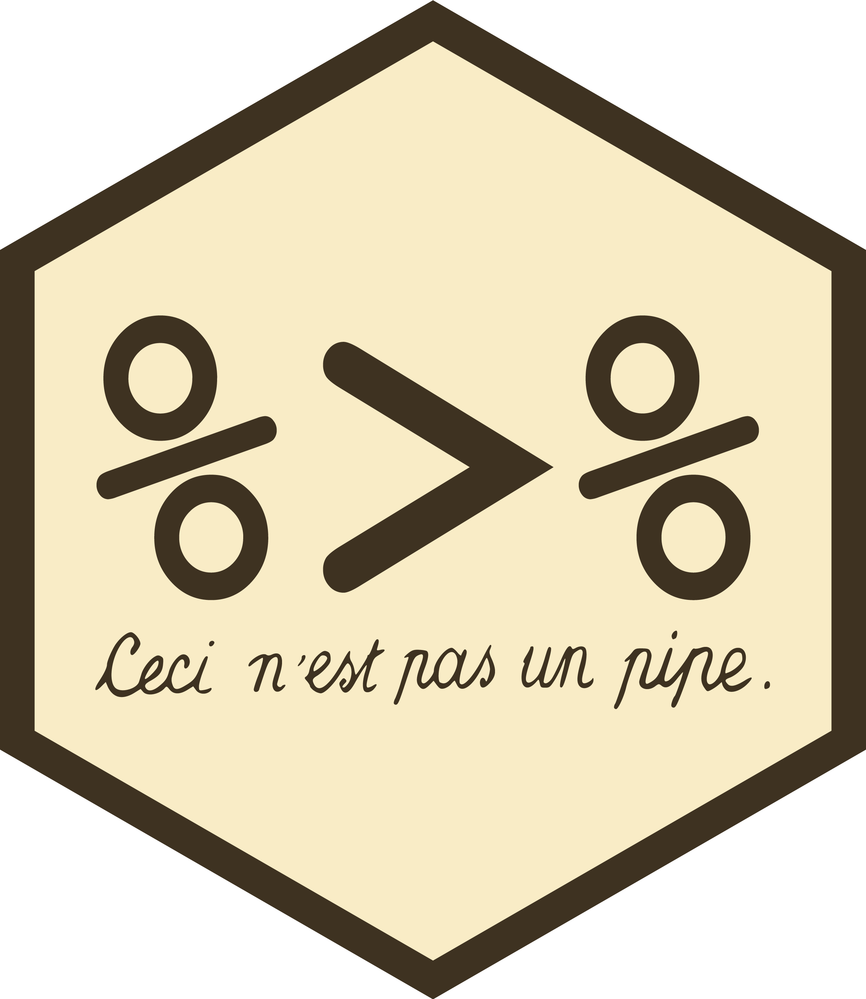

```{r setup}
#| echo: FALSE
#| results: hide

# the code below will load the necessary packages for this assignment
# packages are normally loaded using library(packageName) after installing them.
# the `pacman` package has a function called `p_load` that checks if a package is installed.
# if it isn't installed, it will install it, otherwise it will load it.

# this line installs the pacman package, if you need it
if(!require(pacman)){
  install.packages(pacman)
  library(pacman)
}

pacman::p_load(countdown)
pacman::p_load(MASS)
pacman::p_load(tidyverse)
pacman::p_load(janitor)

# data setup
data(birthwt)
head(birthwt)

```

## Data manipulation
- Rarely is data in the exact format you need for visualization and analysis. Often you will need to:
  - Select relevant variables.
  - Filter observations to samples of interest.
  - Create new variables that are functions of existing ones.
  - Summarize data points.
  - Rename variables.
  - Rearrange observations or variables into a more manageable or intuitive format.

## Data manipulation with `dplyr`
- `dplyr` is a `tidyverse` package the provides functions for the grammar of data manipulation.
  - `select` relevant variables.
  - `filter` observations to samples of interest.
  - `mutate` new variables that are functions of existing ones.
  - `summarise` data points.
  - `rename` variables.
  - `arrange` observations or `relocate` variables into a more manageable or intuitive format.

## `dplyr`
- Notice that some functions operate on rows (`filter`, `arrange`), while some work on columns (`select`, `mutate`, `rename`).
- These functions combine easily with:
  - `group_by` another `dplyr` function for perform any operation "by group".
  - Pipes (`%>%` and `|>`) that easily combine verbs.

## `dplyr` and masking {.smaller}

```{r masking}
#| message: TRUE

library(tidyverse)

```

- `R` lets us know that there are conflicts between packages.
- In this case, between `dplyr` and other loaded packages.
  - Particularly `stat` which is loaded by default and `MASS` which we loaded for our birthweight data.

. . .

- Since dplyr was loaded last it "masks" the functions with the same name from other packages
  - To used the `filter` function from the `stats` package you'll need to use the full name `stats::filter`. Likewise for `MASS::select`.
  - `packagename::function` syntax is always available and precise!

## `dplyr` basics {.smaller}
- Each function ("verb") is designed to do one action and do it well.
  - Gives rise to a modular structure that combines functions easily.
      - Yay for piping!!
- Although each function has a specific task, they share a common structure:
  - The first argument is always a data frame.
  - The subsequent arguments typically describe which columns to operate on using the variable names (without quotes).
  - The output is always a new data frame.

## Aside: Tibbles
- A core component of the tidyverse is the `tibble` package, which extends data frames to be more modern.
- Tibbles *are* data.frames. 
- But they have nicer a printing method and are "lazy" and "surly".
  - They do less, they don’t change variable names or types
    - E.g., $n \times 1$ subset remains a tibble instead of a vector.
  - They don’t do partial matching.
  - They complain more.
    - E.g., if a variable doesn't exist.

## `birthwt` tibble

```{r birthwt1}

head(birthwt)

```

```{r birthwt2}
birthwt = tibble::as_tibble(birthwt)
birthwt

```

## Pipes
> In software engineering, a pipeline consists of a chain of processing elements, arranged so that the output of each element is the input of the next. *[Wikipedia](https://en.wikipedia.org/wiki/Pipeline_(software))*

. . .

::::{.columns}

:::{.column width="50%"}
{fig-alt="Painting of a brown tobacco pipe with the handwritten French caption 'Ceci n'est pas une pipe' ('This is not a pipe') below it. René Magritte's The Treachery of Images (1929)." fig-align=center}
:::

:::{.column width="50%"}
{fig-alt="Hexagonal badge with the R 'pipe' operator symbol '%>%' displayed, and the handwritten caption 'Ceci n'est pas un pipe' ('This is not a pipe') below, a pun on Magritte's painting, referencing the magrittr R package." height=3in fig-align=center}
:::

::::

## Magrittr and native pipes {.smaller}
- Pipes were first introduced into R in 2014 as `%>%` via the `magrittr` [package](https://magrittr.tidyverse.org/).
  - Part of `tidyverse` ecosystem.
- The native pipe `|>` was introduced in 2021 and updated in 2023.
  - Does not require any package to be loaded to use.
- The keyboard shortcuts:
  - [Shift + Command + M]{style="font-family: monospace;"} (Mac)
  - [Shift + Ctrl + M]{style="font-family: monospace;"} (Windows)
  - Default is `magrittr` pipe but this can be changed in settings, if desired.

. . .

The follow lines of code are equivalent.

::::{.columns}

:::{.column width="33%"}
```r
f(x)
mean(x)
```
:::


:::{.column width="33%"}
```r
x |> f()
x |> mean()
```
:::

:::{.column width="33%"}
```r
x %>% f()
x %>% mean()
```
:::

::::

## Readability of pipes {.smaller}
Pipes make your code more readable by:

- Avoiding nested function calls.

```{r ex-pipe1, eval = F}

work_RAD = do_science(do_lecture(commute(morning_RAD)))

```

. . .

- Minimizing the need for local variables and function definitions.

```{r ex-pipe2, eval = F}

commuter_RAD = commute(morning_RAD)
teacher_RAD = do_lecture(commuter_RAD)
work_RAD = do_science(teacher_RAD)

```

. . .

- Structuring sequences of data operations left-to-right (as opposed to from the inside and out).

```{r ex-pipe3, eval = F}

work_RAD = morning_RAD |> 
  commute() |> 
  do_lecture() |> 
  do_science()

```

. . .

- Making it easy to add steps anywhere in the sequence of operations.

```{r ex-pipe4, eval = F}

work_RAD = morning_RAD |> 
  commute() |> 
  do_lecture() |> 
  eat_lunch() |> 
  do_science()

```

## More about pipes
- `|>` can be read as "and then".
- Deciding between the two pipes is a personal preference (or could just not pipe).
  - Can mostly be used interchangeably.
  - Native pipe requires >= R v4.1
- Typically, the output of the prior line is passed as the first argument of the next line.
  - You can specify the use of a different argument with `.` for `%>%` or `_` for `|>`.

```{r pipe, eval = F}

birthwt %>% boxplot(bwt ~ race, data = .)
birthwt |> boxplot(bwt ~ race, data = _)

```


## Common row-wise functions
- `filter()`: pick rows based on logical conditions.
- `slice()`: pick rows based on positional index.
- `arrange()`: sort/reorder rows based on variable(s).
- `distinct()`: filter for unique rows.
- `group_by()`/`ungroup()`: modifying verb (tbl $\leftrightarrow$ grouped tbl) for subsequent verbs to act upon.
- `summarise()`/`count()`: creates new tbl by collapsing multiple rows into summary.
- ... many others!

## `filter()`
- Keeps or removes rows based on the values of column(s) [variable(s)].
- Takes a data frame as input. Second and subsequent arguments are conditions that must be true to keep the row.

```{r filter1}

dplyr::filter(birthwt, age > 25)

```

## `filter()` {.smaller}
::: notes
- Switching to pipe notation.
:::

- Available logical operators: `>` (greater than), `>=` (greater than or equal to), `<` (less than), `<=` (less than or equal to), `==` (equal to), and `!=` (not equal to).
- Conditions with `&` or `,` indicate "and" statements (check for both conditions). Conditions with `|` indicate "or" statements (check for either condition).

. . .

```{r filter2}

# keep between age 25 (exclusive) and 30 (inclusive)
birthwt |> dplyr::filter(age > 25 & age <= 30)

# keep older than 25 with history of hypertension
birthwt |> dplyr::filter(age > 25, ht == 1)

```

## `filter()` {.smaller}
- `&` and `|` statements need to be in logical for every condition (i.e no `var == 1 | 2`).

```{r filter3}

birthwt |> dplyr::filter(ftv == 2 | ftv == 3 | ftv == 4)

```

. . .

- `%in%` is a shortcut for combining `==` and `|` when using the same variable.

```{r filter4}

birthwt |> dplyr::filter(ftv %in% c(2, 3, 4))

```

## `filter()` {.smaller}
- So far the syntax has been selecting rows to keep, can also provide which rows to drop.

```{r filter5}

birthwt |> dplyr::filter(race != 1 & race != 2)

```

- Notice that `!` + `%in%` is equivalent to a drop statement with `&`.

```{r filter6}

birthwt |> dplyr::filter(!(race %in% c(1, 2)))

```

## `filter()` {.smaller}
- All `dplyr` functions create and print a new data frame. The existing data frame is **never** modified.

```{r filter7}

birthwt

birthwt.over25 = birthwt |> dplyr::filter(age > 25)
birthwt.over25

```

## `slice()` {.smaller}
- Extracts rows using integer location.
- Input is a data frame and a positional index.

```{r slice1}

birthwt |> dplyr::slice(7:10)

```

. . .

```{r}

birthwt |> dplyr::slice_head(n = 2)
```

. . .

```{r}

birthwt |> dplyr::slice_tail(prop = 0.02)

```

## `slice()`
- `slice_min` and `slice_max` select the rows with the smallest or largest values of a variable.

```{r slice2}

birthwt |> dplyr::slice_min(age, n = 1)

birthwt |> dplyr::slice_max(bwt, n = 1)

```

## `arrange()`
::: notes
- first order by age then within age order by bwt
:::

- Changes the order of the rows based on the value of column(s).
- Input is a data frame and a set of column names to order by. 
- Each additional column will be used to break ties in the values of the preceding columns.

```{r arrange1}

birthwt |> dplyr::arrange(age, bwt)

```

## `arrange()`
- `desc()` can be used on a column inside of `arrange()`.
  - Reorders the rows based on that column in descending (big-to-small) order.

```{r arrange2}

birthwt |> dplyr::arrange(desc(age))

```

Remember the number of rows has not changed. We’re only *arranging* the data, we’re **not** filtering it.

## `distinct()`
::: notes
- Not all rows are returned, some patients must have the same covariate combination
- No id variable in this dataset
:::

- Finds all the unique rows in a dataset.

```{r distinct1}

birthwt |> dplyr::distinct()

```

- Typically in a cross-sectional study, with an ID variable, this returns the full dataset.
  - Helpful for finding duplicate entries.

## `distinct()`
- Typically pulling the distinct combinations of a set variables is of interest.

```{r distinct2}

birthwt |> dplyr::distinct(age, ftv)

```

## `distinct()`
- Pulls distinct combinations in the order they appear in the dataset. As such, it is often helpful to order rows by combining with `arrange()`.

```{r distinct3}

birthwt |> 
  dplyr::distinct(age, ftv) |> 
  dplyr::arrange(age, ftv)

```

## `count()`
- For counting the number of occurrences for a combination of variables.

```{r count1}

birthwt |> 
  dplyr::count(age, ftv)

```


## `count()`
- Use sort to arrange from largest to smallest group.

```{r count2}

birthwt |> 
  dplyr::count(age, ftv, sort = TRUE)

```

## `summarise()`
- Reduces the data frame to have a single row. Each column is the summary statistic(s) provided.
- Particularly helpful with grouped tibbles (we'll get there...).

```{r summarise}

birthwt |> 
  summarise(
    n = n(), # numb of obs - alternative to count() within summarise()
    min_age = min(age), 
    median_age = median(age), 
    mean_age = mean(age), 
    max_age = max(age), 
    sd_age = sd(age)
  )

```

## Exercise: Row-wise functions {.smaller .scrollable}

```{code-blanks-instructions}

Create a dataset of: 

  1. observations with mothers weight greater than 150 and two 1st trimester visits.

  2. observations with the ten largest birth weight.

  3. of all observations ordered from most to least 1st trimester visits

  4. enumerating the number of observations for each hypertension (ht) and uterine irritability (ui) combination.
```

```{code-blanks}
#| blank:
#|   target: filter
#|   prefill: false
#|   occurrence: 1
#|   match: token
#| blank:
#|   target: lwt > 150
#|   prefill: false
#|   occurrence: 1
#|   match: token
#| blank:
#|   target: ftv == 2
#|   prefill: false
#|   occurrence: 1
#|   match: token

birthwt |> filter(lwt > 150, ftv == 2)
```

```{code-blanks}
#| blank:
#|   target: slice_max
#|   prefill: false
#|   occurrence: 1
#|   match: token
#| blank:
#|   target: n = 10
#|   prefill: false
#|   occurrence: 1
#|   match: token

birthwt |> slice_max(bwt, n = 10)
```

```{code-blanks}
#| blank:
#|   target: arrange
#|   prefill: false
#|   occurrence: 1
#|   match: token
#| blank:
#|   target: desc(ftv)
#|   prefill: false
#|   occurrence: 1
#|   match: token

birthwt |> arrange(desc(ftv)) |> head()
```

```{code-blanks}
#| blank:
#|   target: count
#|   prefill: false
#|   occurrence: 1
#|   match: token
#| blank:
#|   target: ht, ui
#|   prefill: false
#|   occurrence: 1
#|   match: token

birthwt |> count(ht, ui)

```

```{r}
#| echo: FALSE

countdown::countdown(minutes = 5, top = 0)

```

## Common column-wise functions
- `mutate()`: create or modify columns.
- `select()`: extract specific columns by name.
- `rename()`: rename columns using old name.
- `relocate()`: change column positions.
- `pull()`: pull column into a vector.
- ... many others!

## `mutate()`
- Add new columns calculated from existing ones.

```{r mutate}

birthwt |> dplyr::mutate(bwt_lbs = bwt/453.6)

```

- By default new columns are added to the right-hand side of the data frame.

## `mutate()`
- `ifelse()` works well if there are only two groups.

```{r mutate2}

birthwt |> 
  dplyr::mutate(ht_chr = ifelse(ht == 1, "hypertension", "no hypertension"))

```

## `mutate()` + `case_when()` {.smaller}
::: notes
- logical reads as "if"
- ~ reads as "then"
- , reads as "else"
- .default is the final else
  - . indicates its a function arugment
:::

- `case_when()` is a vectorized version of an ifelse statement.

```{r mutate3}

birthwt.clean = birthwt |> 
  dplyr::mutate(
    ht_chr = dplyr::case_when(
      ht == 1 ~ "Hypertension", 
      ht == 0 ~ "No hypertension", 
      .default = NA
    ), 
    race = dplyr::case_when( # this will write over the orginal race var
      race == 1 ~ "White", 
      race == 2 ~ "Black", 
      race == 3 ~ "Other", 
      .default = NA
      )
    )
birthwt.clean

```

- Options to consider: when to write over a variable and/or object.

## `select()` {.smaller}
- If a data set has many variables, `select()` helps narrow down to a useful subset.
- Inputs are a data frame and variable names.
  - `var1:var2` selects all variables between `var1` and `var2`

::::{.columns}

:::{.column width="50%"}
```{r select1}

birthwt |> 
  dplyr::select(age, lwt, race, bwt)
```
:::

:::{.column .fragment .fade-in width="50%"}
```{r select2}

birthwt |> 
  dplyr::select(age:race, bwt)

```
:::

::::

. . .

Compared to base R:

```{r subset-baseR}

birthwt[,c("age", "lwt", "race", "bwt")] |> head(2)

```

## `select()`: Dropping variables {.smaller}
- `!` reads as not and drops variables.
- Historically this was done with `-`, so older code may use this syntax.
  - Need `c()` before `-` for ranges.
- `!` is now recommended.

::::{.columns}

:::{.column width="50%"}
```{r select3}

birthwt |> 
  dplyr::select(!age:race)

```
:::

:::{.column width="50%"}
```{r select4}

birthwt |> 
  dplyr::select(-c(age:race))

```
:::

::::

## `select()`: Dropping variables {.smaller}
- Multiple separate drop statements, i.e., not a single range (`:`), need `&` or `c()`.
- `,` alone won't work for dropping.

::::{.columns}

:::{.column width="50%"}

```{r select5}

birthwt |> 
  dplyr::select(!age:race & !bwt)

```
:::

:::{.column width="50%"}

```{r select6}

birthwt |> 
  dplyr::select(!c(age:race, bwt))

```
:::

::::

## `select()` + `where()` {.smaller}
- `where()` takes a function as an input.

```{r select7}

birthwt.clean |> dplyr::select(dplyr::where(is.character)) # shorthand

```

```{r select8}

birthwt.clean |> dplyr::select(dplyr::where(function(x) !is.character(x) ) ) # long form

```

## `relocate()`
- Moves column(s) to the start of the data frame by default.

```{r relocate1}

colnames(birthwt)

birthwt |> dplyr::relocate(bwt, lwt, age)

```

## `relocate()`
- Or to the end of the data frame.

```{r relocate2}

birthwt |> dplyr::relocate(lwt, age, .after = tidyr::last_col())

```

## `relocate()`
- Or after a specific variable. The `.before` argument works the same way.

```{r relocate3}

birthwt |> dplyr::relocate(bwt, .after = lwt)

```

## `rename()`
- If you want to keep all columns but rename a few use `rename()`.
- `newName = oldName` syntax.

```{r rename}

birthwt.messyNames = birthwt |> 
  dplyr::rename(Birthweight = bwt, 
                `Mother weight` = lwt)
birthwt.messyNames

```

## `rename()` vs. `janitor` package
- When many (potentially most, if not all) names have a messy structure using `janitor::clean_names()` is a better option than renaming all variables individually.

```{r janitor}

birthwt.messyNames |> 
  janitor::clean_names()

```

## Multiple verbs with piping {.smaller}
- So far we have only used the pipe function with one `dplyr` function/verb.
- The power of `dplyr` and piping really comes out when stringing together multiple functions/verbs.

```{r multiverb1}

birthwt |> 
  dplyr::filter(low == 1, smoke == 1, age < 20) |> # keep subjects with low birthwt, smokers, under 20
  dplyr::select(age, race, lwt, bwt) |> # keep age, race, mother's weight, and birthwt vars
  dplyr::mutate(bwt_lbs = bwt/453.6) |> # turn grams into lbs
  dplyr::select(-bwt) |> # remove birthwt g var
  dplyr::arrange(lwt) # order by mother's weight

```

## Multiple verbs with piping {.smaller}
- Without piping the code on the previous slide would have been executed with nested functions

```{r multiverb2}

arrange(
  select(
    mutate(
      select(
        filter(birthwt, low == 1, smoke == 1, age < 20), 
        age, race, lwt, bwt), 
      bwt_lbs = bwt/453.6), 
    -bwt), 
  lwt)

```

- Or separate code lines with or without overriding object names.

```{r multiverb}

birthwt.filter = dplyr::filter(birthwt, low == 1, smoke == 1, age < 20)
birthwt.filter = dplyr::select(birthwt.filter, age, race, lwt, bwt)
birthwt.filter = dplyr::mutate(birthwt.filter, bwt_lbs = bwt/453.6)
birthwt.filter = dplyr::select(birthwt.filter, -bwt)
birthwt.filter = dplyr::arrange(birthwt.filter, lwt)

```

## Exercise: Column-wise functions {.smaller .scrollable}

```{code-blanks-instructions}
Using the `birthwt` dataset:

  1. Remove `race`, `ptl`, `ht`, and `ui` from the dataset
  
  2. Change `smoke` to `smoking_status` and `low` to `low_bwt`

  3. Move the low birthweight variable after the birthweight variable.
```

```{code-blanks}
#| blank:
#|   target: select
#|   prefill: false
#|   occurrence: 1
#|   match: token
#| blank:
#|   target: !c(race, ptl, ht, ui)
#|   prefill: false
#|   occurrence: 1
#|   match: token
#| blank:
#|   target: rename
#|   prefill: false
#|   occurrence: 1
#|   match: token
#| blank:
#|   target: smoking_status = smoke
#|   prefill: false
#|   occurrence: 1
#|   match: token
#| blank:
#|   target: low_bwt = low
#|   prefill: false
#|   occurrence: 1
#|   match: token
#| blank:
#|   target: relocate
#|   prefill: false
#|   occurrence: 1
#|   match: token
#| blank:
#|   target: .after
#|   prefill: false
#|   occurrence: 1
#|   match: token
#| blank:
#|   target: last_col()
#|   prefill: false
#|   occurrence: 1
#|   match: token

birthwt |> 
  select(!c(race, ptl, ht, ui)) |> 
  rename(smoking_status = smoke, low_bwt = low) |> 
  relocate(low_bwt, .after = last_col()) |> 
  head()

```

```{r}
#| echo: FALSE

countdown::countdown(minutes = 5, top = 0)

```

## `pull()`
- Works similar to `$` but in the grammar of data manipulation. Also works better with pipes.

```{r pull1}

birthwt |> dplyr::pull(bwt) |> head()

birthwt |> dplyr::pull(-1) |> head()

birthwt |> dplyr::pull(1) |> head()

```

## `pull()`

```{r pull2}
#| fig-height: 4
#| fig-width: 6
#| fig-align: center
#| fig-alt: "Histogram of birth weights (grams), roughly bell-shaped and slightly left-skewed. Values range from about 500 to 5000, with the peak frequency (around 45) in the 3000–3500 bin. Most observations fall between 2000 and 4000."

birthwt |> dplyr::pull(bwt) |> summary()

birthwt |> dplyr::pull(bwt) |> sd()

birthwt |> dplyr::pull(bwt) |> hist()

```

## Operations on groups: `group_by()` {.smaller}
- Use `group_by()` to divide a dataset into groups meaningful for analysis.

```{r group1}

birthwt |> 
  dplyr::group_by(smoke)

```

- Notice that the data has not changed, but the output indicates that it is “grouped by” smoke (Groups: smoke [2]).
  - This means subsequent operations will be performed "by smoke group".

## `group_by()` {.smaller}
- Combining `group_by()` and `summarise()` to calculate group-specific summary statistics is often helpful.

```{r group2}
#| output-location: "column"

birthwt |> 
  dplyr::group_by(smoke) |> # by smoking status
  dplyr::summarise(
    mean.bwt = mean(bwt), # mean bwt
    sd.bwt = sd(bwt)      # sd bwt
  )

```

```{r group3}
#| message: TRUE
#| output-location: "column"

birthwt |> 
  dplyr::group_by(smoke, race) |> # by smoking status and race
  dplyr::summarise(
    mean.bwt = mean(bwt), # mean bwt
    sd.bwt = sd(bwt)      # sd bwt
  )

```

## Resoving the `group_by` warning {.smaller}
::: notes
- Use keep if doing more group based calculations, drop if you want to work on all the rows of the summarized data set.
:::

```{r group4}

birthwt |> 
  dplyr::group_by(smoke, race) |> 
  dplyr::summarise(
    mean.bwt = mean(bwt), 
    sd.bwt = sd(bwt), 
    .groups = "drop" # drop groups after computation
  )

```

```{r group5}

birthwt |> 
  dplyr::group_by(smoke, race) |> 
  dplyr::summarise(
    mean.bwt = mean(bwt), 
    sd.bwt = sd(bwt), 
    .groups = "keep" # keep groups after computation
  )

```

## Resolving the `group_by` warning
- The `.by` argument is typically used for per operation grouping while `group_by()` is intended for persistent grouping.

```{r group6}

birthwt |> 
  dplyr::summarise(
    .by = c(smoke, race), # alt to group_by
    mean.bwt = mean(bwt), 
    sd.bwt = sd(bwt)
  )

```

